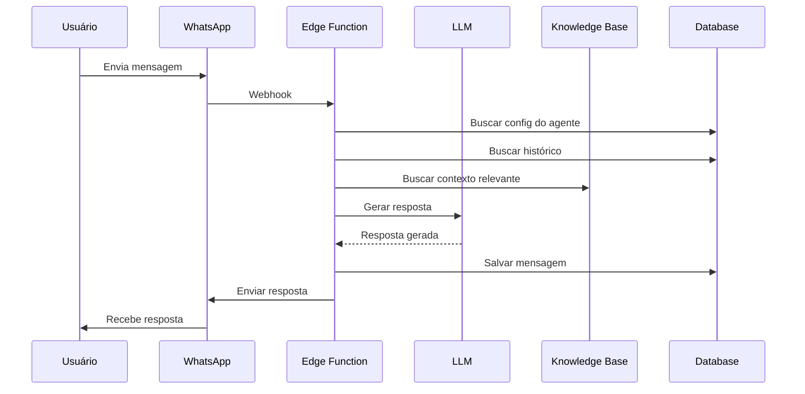

# APIs de IA / Chatbot

## inbox-ai-assistant

Processa mensagens com assistente de IA e gera respostas automáticas.

**Endpoint:** `POST /functions/v1/inbox-ai-assistant`  
**Autenticação:** Bearer Token (obrigatório)

### Request Body

| Campo | Tipo | Obrigatório | Descrição |
|-------|------|-------------|-----------|
| conversationId | string | Sim | ID da conversa |
| messageContent | string | Sim | Conteúdo da mensagem recebida |
| agentConfigId | string | Não | ID do agente específico |

### Response

```json
{
  "success": true,
  "data": {
    "response": "Resposta gerada pela IA",
    "shouldRespond": true,
    "handoffRequested": false,
    "tokensUsed": 150
  }
}
```

### Lógica de Processamento

1. Busca configuração do agente de IA
2. Verifica horário de atendimento
3. Verifica limite de interações
4. Busca histórico da conversa
5. Consulta base de conhecimento
6. Gera resposta via LLM
7. Verifica palavras-chave de handoff
8. Envia resposta (se aplicável)

### Exemplo

```typescript
const { data, error } = await supabase.functions.invoke('inbox-ai-assistant', {
  body: {
    conversationId: '123e4567-e89b-12d3-a456-426614174000',
    messageContent: 'Qual o horário de funcionamento?'
  }
});
```

---

## chatbot-ai-condition

Avalia condições em fluxos de chatbot usando IA.

**Endpoint:** `POST /functions/v1/chatbot-ai-condition`  
**Autenticação:** Bearer Token (obrigatório)

### Request Body

| Campo | Tipo | Obrigatório | Descrição |
|-------|------|-------------|-----------|
| executionId | string | Sim | ID da execução do chatbot |
| nodeId | string | Sim | ID do nó de condição |
| userMessage | string | Sim | Mensagem do usuário |
| condition | string | Sim | Condição a avaliar |

### Response

```json
{
  "success": true,
  "data": {
    "result": true,
    "confidence": 0.92,
    "reasoning": "O usuário expressou interesse em agendar"
  }
}
```

### Tipos de Condição

| Tipo | Exemplo |
|------|---------|
| intent | "Usuário quer agendar consulta" |
| sentiment | "Usuário está satisfeito" |
| contains | "Mensagem contém número de telefone" |
| custom | Condição personalizada em linguagem natural |

---

## transcribe-audio

Transcreve áudio de mensagens de voz.

**Endpoint:** `POST /functions/v1/transcribe-audio`  
**Autenticação:** Bearer Token (obrigatório)

### Request Body

| Campo | Tipo | Obrigatório | Descrição |
|-------|------|-------------|-----------|
| audioUrl | string | Sim | URL do áudio |
| messageId | string | Não | ID da mensagem (para salvar transcrição) |
| language | string | Não | Idioma (default: "pt-BR") |

### Response

```json
{
  "success": true,
  "data": {
    "transcription": "Texto transcrito do áudio",
    "duration": 15.5,
    "language": "pt-BR",
    "confidence": 0.95
  }
}
```

### Exemplo

```typescript
const { data, error } = await supabase.functions.invoke('transcribe-audio', {
  body: {
    audioUrl: 'https://storage.example.com/audio.ogg',
    language: 'pt-BR'
  }
});
```

---

## analyze-conversation

Analisa uma conversa e gera insights.

**Endpoint:** `POST /functions/v1/analyze-conversation`  
**Autenticação:** Bearer Token (obrigatório)

### Request Body

| Campo | Tipo | Obrigatório | Descrição |
|-------|------|-------------|-----------|
| conversationId | string | Sim | ID da conversa |
| analysisType | string | Não | Tipo de análise |

### Response

```json
{
  "success": true,
  "data": {
    "summary": "Resumo da conversa",
    "sentiment": "positive",
    "topics": ["agendamento", "preços"],
    "nextActions": ["Enviar proposta", "Agendar reunião"],
    "leadScore": 85
  }
}
```

### Tipos de Análise

| Tipo | Descrição |
|------|-----------|
| summary | Resumo da conversa |
| sentiment | Análise de sentimento |
| topics | Extração de tópicos |
| lead_score | Pontuação do lead |
| full | Todas as análises |

---

## Configuração do Agente de IA

### Campos Principais

| Campo | Descrição |
|-------|-----------|
| personality_prompt | Prompt de personalidade |
| greeting_message | Saudação inicial |
| fallback_message | Resposta quando não entende |
| max_interactions | Máximo de interações antes de handoff |
| handoff_keywords | Palavras que acionam handoff |
| response_mode | Modo: text, audio, auto |

### Exemplo de Personality Prompt

```
Você é um assistente virtual da Empresa X.
Seja sempre cordial e profissional.
Responda de forma clara e objetiva.
Se não souber a resposta, diga que vai verificar.
Nunca invente informações.
```

---

## Base de Conhecimento

### Tipos de Fonte

| Tipo | Descrição |
|------|-----------|
| text | Texto digitado manualmente |
| file | Documento PDF/DOCX |
| website | Conteúdo de página web |

### Status de Processamento

| Status | Descrição |
|--------|-----------|
| pending | Aguardando processamento |
| processing | Em processamento |
| completed | Processado com sucesso |
| failed | Falha no processamento |

---

## Fluxo de Atendimento IA



---

## Modelos Suportados

| Modelo | Uso Recomendado |
|--------|-----------------|
| google/gemini-2.5-flash | Respostas rápidas, baixo custo |
| google/gemini-2.5-pro | Raciocínio complexo |
| openai/gpt-5-mini | Equilíbrio custo/qualidade |
| openai/gpt-5 | Máxima qualidade |

---

## Tokens e Custos

Os tokens são debitados da conta do usuário:

```typescript
// Verificar saldo
const { data } = await supabase
  .from('user_ai_tokens')
  .select('balance')
  .eq('user_id', userId)
  .single();

// Histórico de uso
const { data: transactions } = await supabase
  .from('ai_token_transactions')
  .select('*')
  .eq('user_id', userId)
  .order('created_at', { ascending: false });
```
