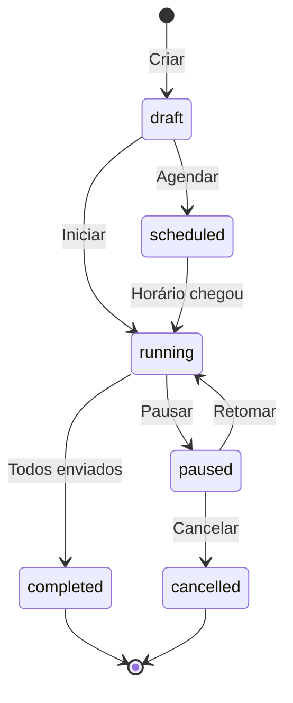

# APIs de Campanhas

## start-campaign

Inicia o envio de uma campanha de mensagens.

**Endpoint:** `POST /functions/v1/start-campaign`  
**Autenticação:** Bearer Token (obrigatório)

### Request Body

| Campo | Tipo | Obrigatório | Descrição |
|-------|------|-------------|-----------|
| campaignId | string | Sim | ID da campanha |

### Response

```json
{
  "success": true,
  "data": {
    "campaignId": "uuid",
    "status": "running",
    "totalContacts": 150,
    "startedAt": "2024-01-15T10:00:00Z"
  }
}
```

### Exemplo

```typescript
const { data, error } = await supabase.functions.invoke('start-campaign', {
  body: {
    campaignId: '123e4567-e89b-12d3-a456-426614174000'
  }
});
```

---

## send-campaign-messages

Processa o envio de mensagens da campanha. Chamado internamente em loop.

**Endpoint:** `POST /functions/v1/send-campaign-messages`  
**Autenticação:** Bearer Token (obrigatório)

### Request Body

| Campo | Tipo | Obrigatório | Descrição |
|-------|------|-------------|-----------|
| campaignId | string | Sim | ID da campanha |
| batchSize | number | Não | Tamanho do lote (default: 10) |

### Response

```json
{
  "success": true,
  "data": {
    "processed": 10,
    "sent": 9,
    "failed": 1,
    "remaining": 140,
    "completed": false
  }
}
```

### Lógica de Envio

1. Busca próximo lote de contatos pendentes
2. Para cada contato:
   - Processa variáveis do template
   - Envia mensagem via instância WhatsApp
   - Registra status em `campaign_messages`
3. Respeita intervalos configurados entre mensagens
4. Verifica limites diários
5. Continua até completar ou pausar

---

## pause-campaign

Pausa uma campanha em andamento.

**Endpoint:** `POST /functions/v1/pause-campaign`  
**Autenticação:** Bearer Token (obrigatório)

### Request Body

| Campo | Tipo | Obrigatório | Descrição |
|-------|------|-------------|-----------|
| campaignId | string | Sim | ID da campanha |

### Response

```json
{
  "success": true,
  "data": {
    "campaignId": "uuid",
    "status": "paused",
    "sent": 50,
    "remaining": 100
  }
}
```

---

## resume-campaign

Retoma uma campanha pausada.

**Endpoint:** `POST /functions/v1/resume-campaign`  
**Autenticação:** Bearer Token (obrigatório)

### Request Body

| Campo | Tipo | Obrigatório | Descrição |
|-------|------|-------------|-----------|
| campaignId | string | Sim | ID da campanha |

### Response

```json
{
  "success": true,
  "data": {
    "campaignId": "uuid",
    "status": "running",
    "remaining": 100
  }
}
```

---

## Fluxo de Campanha



---

## Configurações de Campanha

### Intervalos

| Campo | Descrição | Default |
|-------|-----------|---------|
| message_interval_min | Intervalo mínimo entre msgs (segundos) | 3 |
| message_interval_max | Intervalo máximo entre msgs (segundos) | 10 |
| daily_limit | Limite diário de envios | 500 |

### Horários Permitidos

| Campo | Descrição |
|-------|-----------|
| allowed_days | Dias permitidos ["monday", "tuesday", ...] |
| allowed_start_hour | Hora de início (0-23) |
| allowed_end_hour | Hora de fim (0-23) |
| timezone | Fuso horário (ex: "America/Sao_Paulo") |

### Modo de Envio

| Modo | Descrição |
|------|-----------|
| sequential | Uma instância por vez |
| round_robin | Alterna entre instâncias |
| random | Escolhe instância aleatoriamente |

---

## Variáveis de Template

Templates suportam variáveis dinâmicas:

| Variável | Descrição |
|----------|-----------|
| `{{nome}}` | Nome do contato |
| `{{primeiro_nome}}` | Primeiro nome |
| `{{telefone}}` | Telefone formatado |
| `{{email}}` | Email do contato |
| `{{campo_xxx}}` | Campo personalizado |

### Exemplo de Template

```
Olá {{primeiro_nome}}, tudo bem?

Estamos entrando em contato para informar sobre nossa nova promoção!

Atenciosamente,
Equipe de Vendas
```

---

## Status de Mensagem de Campanha

| Status | Descrição |
|--------|-----------|
| pending | Aguardando envio |
| sent | Enviada |
| delivered | Entregue |
| failed | Falhou |
| skipped | Pulada (contato já recebeu recentemente) |

---

## Métricas

```typescript
// Buscar métricas da campanha
const { data } = await supabase
  .from('campaigns')
  .select('total_contacts, sent, delivered, failed')
  .eq('id', campaignId)
  .single();

const deliveryRate = (data.delivered / data.sent) * 100;
const failRate = (data.failed / data.sent) * 100;
```
