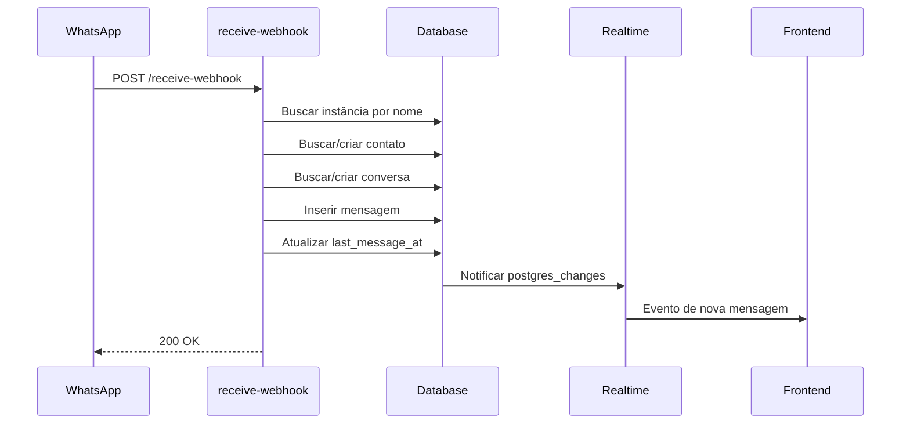

# APIs de Inbox / Mensagens

## send-inbox-message

Envia uma mensagem de texto via WhatsApp ou Instagram.

**Endpoint:** `POST /functions/v1/send-inbox-message`  
**Autenticação:** Bearer Token (obrigatório)

### Request Body

| Campo | Tipo | Obrigatório | Descrição |
|-------|------|-------------|-----------|
| conversationId | string | Sim | ID da conversa |
| content | string | Sim | Conteúdo da mensagem |
| messageType | string | Não | Tipo da mensagem (default: "text") |

### Response

```json
{
  "success": true,
  "data": {
    "messageId": "uuid",
    "whatsappMessageId": "wamid.xxx",
    "status": "sent"
  }
}
```

### Exemplo

```typescript
const { data, error } = await supabase.functions.invoke('send-inbox-message', {
  body: {
    conversationId: '123e4567-e89b-12d3-a456-426614174000',
    content: 'Olá, como posso ajudar?'
  }
});
```

---

## send-inbox-media

Envia mídia (imagem, áudio, documento, vídeo) via WhatsApp.

**Endpoint:** `POST /functions/v1/send-inbox-media`  
**Autenticação:** Bearer Token (obrigatório)

### Request Body

| Campo | Tipo | Obrigatório | Descrição |
|-------|------|-------------|-----------|
| conversationId | string | Sim | ID da conversa |
| mediaUrl | string | Sim | URL da mídia |
| mediaType | string | Sim | Tipo: image, audio, document, video |
| caption | string | Não | Legenda (para imagens/vídeos) |
| fileName | string | Não | Nome do arquivo (para documentos) |

### Response

```json
{
  "success": true,
  "data": {
    "messageId": "uuid",
    "whatsappMessageId": "wamid.xxx"
  }
}
```

### Exemplo

```typescript
const { data, error } = await supabase.functions.invoke('send-inbox-media', {
  body: {
    conversationId: '123e4567-e89b-12d3-a456-426614174000',
    mediaUrl: 'https://storage.example.com/image.jpg',
    mediaType: 'image',
    caption: 'Confira nossa proposta'
  }
});
```

---

## receive-webhook

Webhook para receber mensagens do WhatsApp (Evolution API).

**Endpoint:** `POST /functions/v1/receive-webhook`  
**Autenticação:** Nenhuma (webhook público)

### Request Body (Evolution API)

```json
{
  "event": "messages.upsert",
  "instance": "nome-instancia",
  "data": {
    "key": {
      "remoteJid": "5511999999999@s.whatsapp.net",
      "fromMe": false,
      "id": "message-id"
    },
    "pushName": "Nome do Contato",
    "message": {
      "conversation": "Texto da mensagem"
    }
  }
}
```

### Eventos Suportados

| Evento | Descrição |
|--------|-----------|
| `messages.upsert` | Nova mensagem recebida |
| `messages.update` | Atualização de status (delivered, read) |
| `connection.update` | Mudança de status da conexão |
| `qrcode.updated` | QR Code atualizado |

### Response

```json
{
  "success": true,
  "message": "Webhook processed"
}
```

---

## receive-instagram-webhook

Webhook para receber mensagens do Instagram.

**Endpoint:** `POST /functions/v1/receive-instagram-webhook`  
**Autenticação:** Verificação de assinatura Meta

### Request Body

```json
{
  "object": "instagram",
  "entry": [{
    "id": "page-id",
    "time": 1234567890,
    "messaging": [{
      "sender": { "id": "sender-id" },
      "recipient": { "id": "recipient-id" },
      "timestamp": 1234567890,
      "message": {
        "mid": "message-id",
        "text": "Texto da mensagem"
      }
    }]
  }]
}
```

### Response

```json
{
  "success": true
}
```

---

## Fluxo de Mensagem



---

## Tipos de Mensagem

| Tipo | Descrição | Campos Extras |
|------|-----------|---------------|
| text | Texto simples | content |
| image | Imagem | media_url, caption |
| audio | Áudio | media_url, duration |
| video | Vídeo | media_url, caption |
| document | Documento | media_url, file_name |
| sticker | Figurinha | media_url |
| location | Localização | latitude, longitude |
| contact | Contato | contact_info (JSON) |

---

## Status de Mensagem

| Status | Descrição |
|--------|-----------|
| pending | Aguardando envio |
| sent | Enviada para o servidor |
| delivered | Entregue ao destinatário |
| read | Lida pelo destinatário |
| failed | Falha no envio |
