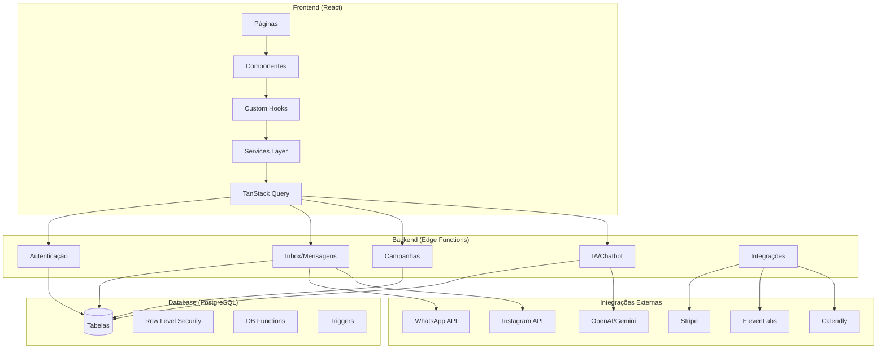
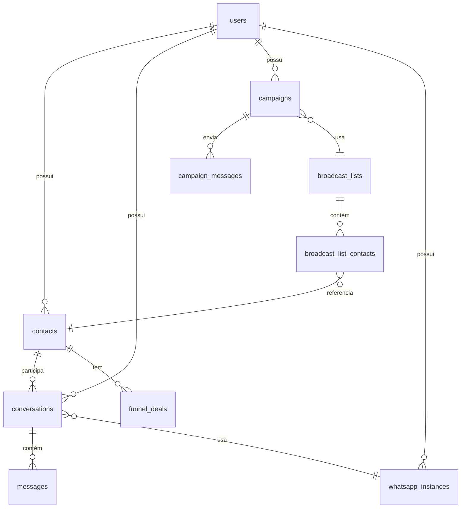
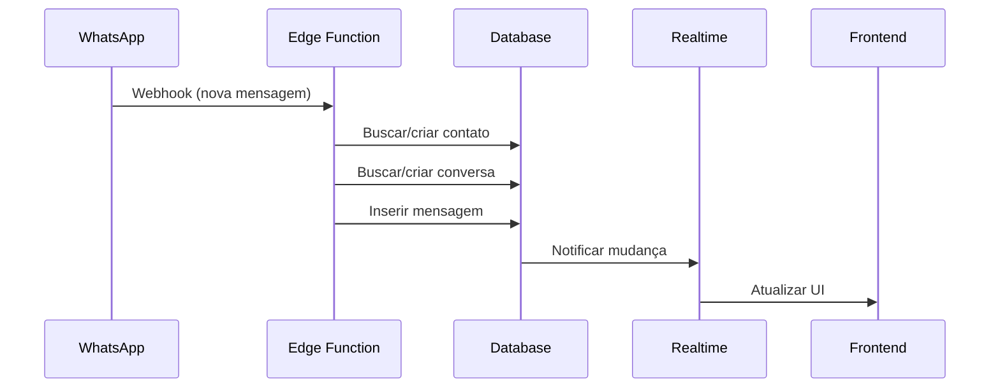
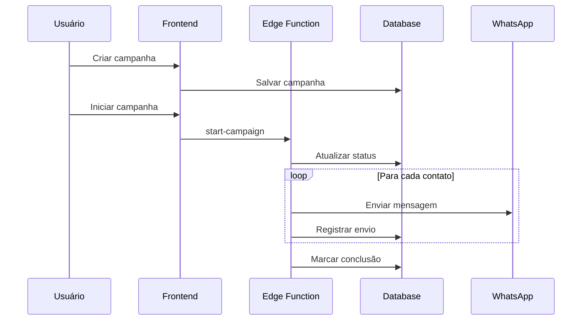

# Arquitetura do Sistema

## Visão Geral

O sistema segue uma arquitetura de 3 camadas com separação clara entre Frontend, Backend (Edge Functions) e Banco de Dados.



## Camadas

### 1. Frontend (React + TypeScript)

#### Páginas (`src/pages/`)
Componentes de rota que representam as telas principais:
- `Index.tsx` - Dashboard principal
- `Inbox.tsx` - Caixa de entrada de mensagens
- `Campaigns.tsx` - Gestão de campanhas
- `Contacts.tsx` - Lista de contatos
- `CRM.tsx` - Funil de vendas
- `Settings.tsx` - Configurações

#### Componentes (`src/components/`)
Organizados por domínio:
- `ui/` - Componentes base do shadcn/ui
- `inbox/` - Lista de conversas, mensagens, composer
- `campaigns/` - Criação e gestão de campanhas
- `contacts/` - Cards, listas e formulários de contatos
- `funnel/` - Kanban, deals, automações

#### Hooks (`src/hooks/`)
Custom hooks para lógica reutilizável:
- `useAuth` - Autenticação do usuário
- `useConversations` - Gestão de conversas
- `useContacts` - CRUD de contatos
- `useWhatsAppInstances` - Instâncias WhatsApp

#### Services (`src/services/`)
Camada de abstração para chamadas de API:
- `whatsappService.ts` - Operações WhatsApp
- `campaignService.ts` - Operações de campanhas

### 2. Backend (Edge Functions)

Edge Functions são funções serverless que rodam no Supabase Edge.

#### Estrutura de uma Edge Function

```typescript
// supabase/functions/nome-funcao/index.ts
import { serve } from "https://deno.land/std@0.168.0/http/server.ts"
import { createClient } from 'https://esm.sh/@supabase/supabase-js@2'

const corsHeaders = {
  'Access-Control-Allow-Origin': '*',
  'Access-Control-Allow-Headers': 'authorization, x-client-info, apikey, content-type',
}

serve(async (req) => {
  // Handle CORS
  if (req.method === 'OPTIONS') {
    return new Response(null, { headers: corsHeaders })
  }

  try {
    // Criar cliente Supabase
    const supabaseClient = createClient(
      Deno.env.get('SUPABASE_URL') ?? '',
      Deno.env.get('SUPABASE_SERVICE_ROLE_KEY') ?? ''
    )

    // Lógica da função
    const body = await req.json()
    
    // Retornar resposta
    return new Response(
      JSON.stringify({ success: true, data: result }),
      { headers: { ...corsHeaders, 'Content-Type': 'application/json' } }
    )
  } catch (error) {
    return new Response(
      JSON.stringify({ error: error.message }),
      { status: 400, headers: { ...corsHeaders, 'Content-Type': 'application/json' } }
    )
  }
})
```

#### Categorias de Edge Functions

| Categoria | Funções | Descrição |
|-----------|---------|-----------|
| **Inbox** | send-inbox-message, send-inbox-media, receive-webhook | Envio/recebimento de mensagens |
| **Campanhas** | start-campaign, send-campaign-messages, pause-campaign | Gestão de campanhas |
| **IA** | inbox-ai-assistant, chatbot-ai-condition, transcribe-audio | Processamento de IA |
| **Integrações** | connect-whatsapp, stripe-webhook, calendly-webhook | Webhooks e conexões |
| **Admin** | create-user, admin-update-user-password | Administração |

### 3. Banco de Dados (PostgreSQL)

#### Row Level Security (RLS)

Todas as tabelas utilizam RLS para garantir que usuários só acessem seus próprios dados:

```sql
-- Exemplo de política RLS
CREATE POLICY "Users can view own contacts"
ON public.contacts
FOR SELECT
USING (auth.uid() = user_id);
```

#### Relacionamentos Principais



## Fluxos Principais

### Fluxo de Mensagem (Recebimento)



### Fluxo de Campanha



## Padrões de Código

### Nomenclatura

- **Componentes**: PascalCase (`MessageComposer.tsx`)
- **Hooks**: camelCase com prefixo `use` (`useConversations.ts`)
- **Funções**: camelCase (`sendMessage`)
- **Constantes**: UPPER_SNAKE_CASE (`MAX_MESSAGE_LENGTH`)
- **Tipos/Interfaces**: PascalCase (`ConversationType`)

### Estrutura de Componente

```tsx
// 1. Imports
import { useState } from 'react';
import { Button } from '@/components/ui/button';

// 2. Types
interface Props {
  title: string;
  onSubmit: () => void;
}

// 3. Component
export const MyComponent = ({ title, onSubmit }: Props) => {
  // 3.1 Hooks
  const [value, setValue] = useState('');
  
  // 3.2 Handlers
  const handleClick = () => {
    onSubmit();
  };
  
  // 3.3 Render
  return (
    <div>
      <h1>{title}</h1>
      <Button onClick={handleClick}>Submit</Button>
    </div>
  );
};
```

### Chamadas de API

```tsx
// Usando TanStack Query
const { data, isLoading, error } = useQuery({
  queryKey: ['contacts'],
  queryFn: async () => {
    const { data, error } = await supabase
      .from('contacts')
      .select('*')
      .order('created_at', { ascending: false });
    
    if (error) throw error;
    return data;
  }
});
```
