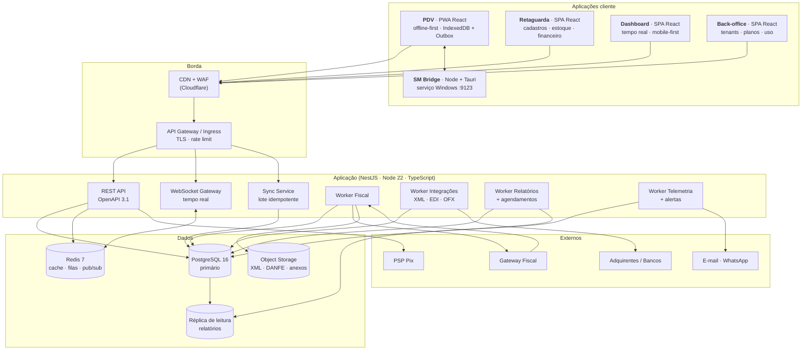
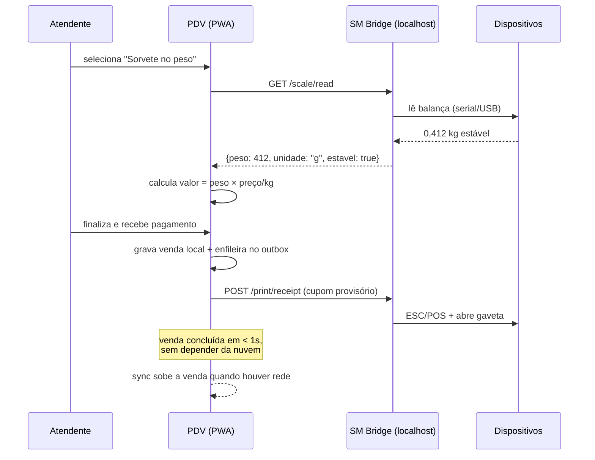
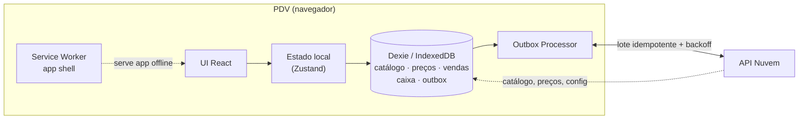
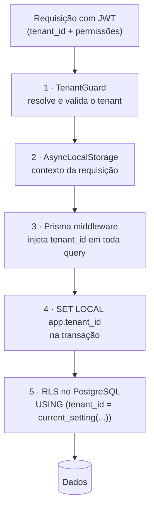
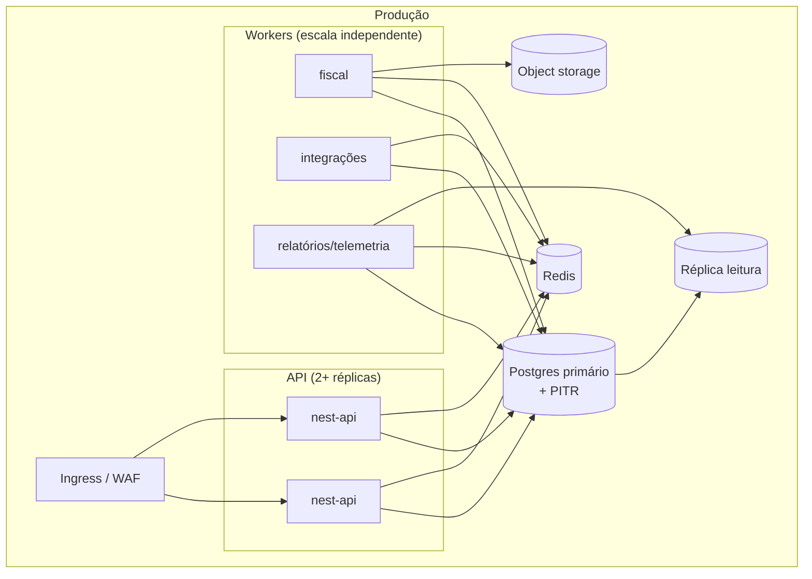

# 02 · Arquitetura da Solução

## 1. Princípios que guiam o desenho

| # | Princípio | O que significa na prática |
|---|-----------|----------------------------|
| A1 | **A loja não pode parar** | O PDV é a fonte da verdade *durante* a venda. Nuvem fora do ar não impede vender. |
| A2 | **A venda não espera a nota** | Emissão fiscal é assíncrona, em fila, com retentativa. Nunca é bloqueante na tela do caixa. |
| A3 | **Um só monólito modular, até doer** | Nada de microsserviços na v1. Fronteiras de módulo bem definidas hoje = extração barata amanhã. |
| A4 | **Tudo é multi-tenant desde a primeira linha** | `tenant_id` obrigatório, isolado em duas camadas. Não existe "depois a gente adapta". |
| A5 | **Fornecedor externo fica atrás de adaptador** | Gateway fiscal, TEF, PSP, banco: interface nossa, implementação deles. |
| A6 | **Dinheiro é inteiro** | Centavos em `bigint`. Ponto flutuante para valor monetário é bug esperando acontecer. |
| A7 | **Movimento é append-only** | Venda, caixa, estoque e fiscal são registros imutáveis; correção gera novo registro. |
| A8 | **O que o dono precisa ver, o sistema mede** | Telemetria de PDV é funcionalidade de produto (RF-20), não item de infra. |

## 2. Visão de contexto (C4 · nível 1)

```mermaid
graph TB
    subgraph Loja["🏪 Quiosque / Loja"]
        Atendente(["👤 Atendente"])
        PDV["PDV<br/>(PWA Windows)"]
        Bridge["SM Bridge<br/>(agente local)"]
        Perif["🖨️ Impressora · Gaveta<br/>⚖️ Balança · 📷 Leitor"]
        Maq["💳 Maquininha avulsa<br/>(não integrada · v1)"]
    end

    subgraph Nuvem["☁️ Soul ERP (SaaS multi-tenant)"]
        API["API + Workers<br/>NestJS"]
        DB[("PostgreSQL")]
        Painel["Retaguarda Web<br/>+ Dashboard"]
        BO["Back-office<br/>da Revenda"]
    end

    Gestor(["👤 Dono / Gerente"])
    Contador(["👤 Contador"])
    Suporte(["👤 Suporte da revenda"])

    Fiscal["Gateway Fiscal<br/>(API terceiro → SEFAZ)"]
    PSP["PSP Pix"]
    Banco["Banco / Adquirente<br/>(OFX · EDI)"]
    Msg["E-mail / WhatsApp"]

    Atendente --> PDV
    PDV <--> Bridge --> Perif
    Atendente -.digita valor.-> Maq
    PDV <-->|"sync + eventos"| API
    API --> DB
    Gestor --> Painel --> API
    Contador --> Painel
    Suporte --> BO --> API
    API -->|"emitir NFC-e"| Fiscal
    Fiscal -->|"webhook autorizado/rejeitado"| API
    API <--> PSP
    API <-- "extratos" --- Banco
    API --> Msg
```

**Leitura do diagrama:** a única coisa entre o atendente e a venda é o PDV local. Tudo mais — nuvem,
fiscal, mensagens — acontece **depois** e de forma assíncrona.

## 3. Visão de contêineres (C4 · nível 2)



## 4. Stack escolhida

| Camada | Escolha | Por quê |
|--------|---------|---------|
| **Linguagem** | TypeScript ponta a ponta (Node 22 LTS) | Um só idioma, tipos compartilhados entre PDV, API e retaguarda; o time já domina |
| **Backend** | **NestJS 11** (monólito modular) | Módulos, DI e camadas explícitas — segura o crescimento de um ERP sem virar espaguete |
| **ORM** | **Prisma 6** + SQL cru onde precisar | Migrations versionadas e tipagem; relatório pesado continua em SQL escrito à mão |
| **Banco** | **PostgreSQL 16** | Transação séria, RLS nativo para multi-tenant, particionamento, `jsonb`, extensões |
| **Cache/Fila** | **Redis 7 + BullMQ** | Fila fiscal, jobs agendados, pub/sub do tempo real, rate limit e cache de catálogo |
| **Storage** | **S3-compatível** (Cloudflare R2 ou MinIO) | Guarda de 5 anos de XML/DANFE por preço baixo |
| **Tempo real** | WebSocket (Socket.IO) sobre Redis pub/sub | Dashboard ao vivo e saúde do terminal |
| **Front** | React 18 + Vite + TypeScript + Tailwind + shadcn/ui + TanStack Query | Mesma stack já usada na casa; PDV usa Zustand para estado local |
| **PDV offline** | PWA + **Dexie (IndexedDB)** + Service Worker + Outbox | Vende sem internet; cache de catálogo e fila de sincronização |
| **Agente local** | **Tauri (Rust shell) + sidecar Node**, serviço do Windows | Acesso a serial/USB/ESC-POS, instalador leve (~10 MB), atualização automática |
| **Auth** | JWT curto + refresh rotativo, argon2id, TOTP opcional | Sem dependência de BaaS; sessão de terminal separada da sessão de operador |
| **Observabilidade** | OpenTelemetry → Grafana (Loki · Tempo · Prometheus) + Sentry | Rastrear uma venda do PDV até a SEFAZ |
| **Infra** | Docker + **Kubernetes gerenciado** (ou Docker Swarm/Coolify no início) | Começar simples; escalar sem migrar de paradigma |
| **CI/CD** | GitHub Actions → registry → deploy com migration automática | Ver [10](./10-QUALIDADE-DEVOPS.md) |

> **Alternativas descartadas e por quê:** ver [ADR-001 e ADR-002](./09-ADRS.md).

## 5. Mapa de módulos (monólito modular)

```
apps/
  api/                    # NestJS: REST + WS + workers
  pdv/                    # PWA do caixa
  web/                    # retaguarda + dashboard
  backoffice/             # painel da revenda
  bridge/                 # agente local Windows
packages/
  contracts/              # tipos e schemas Zod compartilhados (fonte única da verdade)
  ui/                     # design system compartilhado
  money/                  # aritmética de centavos, arredondamento, impostos
```

Módulos do `apps/api` — cada um com `domain/`, `application/`, `infra/` e um `*.module.ts` que
declara **explicitamente** o que exporta:

| Módulo | Responsabilidade | Depende de |
|--------|------------------|------------|
| `tenancy` | Tenant (CNPJ), grupo econômico, planos, entitlements, medição de uso | — |
| `iam` | Usuários, papéis, permissões, sessões, PIN do operador, auditoria | `tenancy` |
| `catalog` | Produtos, SKUs, grade, preços, tributação do item, código de barras | `tenancy` |
| `inventory` | Saldo, movimento, lote/validade, inventário, transferência | `catalog` |
| `pos` | Sessão de caixa, venda em andamento, sincronização, telemetria do terminal | `catalog`, `iam` |
| `sales` | Venda finalizada, devolução, troca, promoção, comissão | `inventory`, `catalog` |
| `payments` | Meios de pagamento, registro de cartão, Pix, TEF (F3) | `sales` |
| `fiscal` | Documentos fiscais, fila de emissão, adaptadores de gateway, guarda de XML | `sales` |
| `purchasing` | Fornecedor, compra, importação de XML, custo | `inventory`, `finance` |
| `finance` | Contas a pagar/receber, caixa, conciliação bancária, DRE | `sales`, `purchasing` |
| `receivables` | Contratos de cartão, previsão e conciliação de recebíveis | `payments`, `finance` |
| `analytics` | Agregados de performance, curva de horário, mix, metas | `sales`, `pos` |
| `telemetry` | Heartbeat do terminal, filas, alertas de saúde | `pos` |
| `reporting` | Relatórios fixos, exportação, agendamento, modelo semântico (F5) | vários (somente leitura) |
| `notifications` | E-mail, WhatsApp, push, templates | — |
| `channels` | Mesas, delivery, totem (F4) | `sales` |
| `operations` | Ordem de serviço, produção/ficha técnica (F5) | `inventory` |

**Regra de fronteira:** módulo **não** importa repositório de outro módulo. Ou chama o *service*
público exportado, ou reage a um **evento de domínio**. Isso é verificado por lint de dependência
(`dependency-cruiser`) no CI — não é acordo de cavalheiros.

## 6. O agente local: **SM Bridge**

O navegador não abre porta serial, não manda ESC/POS para a impressora e não aciona a gaveta.
Por isso existe um agente local — **decisão obrigatória**, não opcional (D5).



**Contrato do SM Bridge** (HTTP local em `https://localhost:9123`, certificado próprio,
token pareado com o terminal):

| Endpoint | Uso |
|----------|-----|
| `GET /health` | Status dos dispositivos — alimenta a saúde do terminal (RF-20.5) |
| `GET /scale/read` | Leitura de peso (Toledo Prix, Filizola, Urano — protocolo por driver) |
| `POST /print/receipt` | Impressão ESC/POS de cupom, comprovante e relatório de caixa |
| `POST /print/danfe` | Impressão do DANFE NFC-e a partir do layout devolvido pelo gateway |
| `POST /drawer/open` | Abertura da gaveta |
| `GET /devices` | Descoberta e teste de dispositivos (tela de configuração) |
| `POST /tef/*` | *(F3)* pagamento, confirmação e estorno via pinpad |
| `GET /version` · `POST /update` | Autoatualização silenciosa |

**Degradação:** se o Bridge não responde, o PDV **continua vendendo**. Peso pode ser digitado
(com permissão, RN-08), o cupom fica pendente de impressão e o terminal aparece com alerta amarelo
no painel de saúde. Nunca trava a venda.

## 7. PDV offline-first



**O que fica no PDV:** catálogo completo do tenant/loja, preços vigentes, dados fiscais do produto,
usuários e PINs autorizados, sessão de caixa atual, vendas do turno e a fila de saída (outbox).

**Regras de ouro:**

1. **O ID da venda nasce no PDV** (UUID v7). O servidor usa esse ID como chave de idempotência —
   reenviar cem vezes cria uma venda só. É isso que garante o RNF-04.
2. **Numeração fiscal não é gerada offline** — a NFC-e é montada e emitida quando a venda chega à
   nuvem. Offline o cliente leva um **comprovante de venda com QR**, e a nota autorizada vai por
   link/e-mail (ver [06 §5](./06-FISCAL.md), que trata o caso e os limites legais).
3. **O relógio do PDV não é confiável.** Grava-se `occurred_at` (local) e `received_at` (servidor);
   relatório usa o do servidor com deriva registrada.
4. **Conflito não existe por design**: o PDV só cria fatos novos (venda, movimento de caixa). Ele
   nunca edita dado central. Cadastro só desce da nuvem para o PDV, nunca sobe.
5. **Retenção local**: 90 dias de vendas no IndexedDB; o resto é podado depois de confirmado no servidor.

## 8. Multi-tenant: como o isolamento funciona

Modelo escolhido: **banco único, schema único, `tenant_id` em toda tabela**, com isolamento em
**duas camadas independentes** (defesa em profundidade):



Se a camada de aplicação falhar (bug, query crua, desenvolvedor distraído), **o banco recusa**.
Um teste do CI tenta ler dados de outro tenant por 6 caminhos diferentes e precisa falhar nos 6.

**Grupo econômico:** um usuário pode ter papéis em vários tenants do mesmo grupo. Consulta
consolidada usa `tenant_id = ANY(:tenants_autorizados)` — a lista vem do token, nunca do parâmetro
enviado pelo cliente.

**Acesso do suporte da revenda:** exige *impersonation* explícita, com motivo, prazo e registro em
auditoria, visível para o cliente. Sem "acesso silencioso de admin".

## 9. Eventos de domínio

Comunicação entre módulos por eventos (in-process na v1, com **outbox transacional** — o evento é
gravado na mesma transação do fato e publicado depois, o que evita "gravou mas não notificou"):

| Evento | Quem reage |
|--------|-----------|
| `sale.finalized` | `fiscal` (emite NFC-e) · `inventory` (baixa) · `analytics` (agrega) · `receivables` (prevê recebível) · `finance` |
| `sale.returned` | `fiscal` · `inventory` · `finance` |
| `fiscal.document.authorized` | `pos` (libera impressão do DANFE) · `notifications` (manda cupom) · `analytics` |
| `fiscal.document.rejected` | `telemetry` (alerta) · retaguarda (fila de correção) |
| `cash.session.closed` | `finance` (consolida) · `analytics` |
| `terminal.heartbeat` | `telemetry` (saúde) |
| `stock.below_minimum` | `notifications` · `purchasing` |
| `tenant.plan.changed` | `tenancy` (entitlements) · todos os módulos via cache |

Migrar para fila externa depois é trocar o *publisher*, não reescrever os módulos.

## 10. Ambientes e topologia de implantação

| Ambiente | Uso | Dados |
|----------|-----|-------|
| `local` | Desenvolvedor, `docker compose up` | Seed sintético |
| `dev` | Integração contínua | Sintético |
| `staging` | Homologação, **gateway fiscal em homologação** | Cópia anonimizada |
| `prod` | Clientes reais | Real, com PITR |



Os **workers escalam separado da API**: pico de emissão fiscal no fim de semana não pode deixar a
tela do gerente lenta, e relatório pesado não pode competir com a venda.

## 11. Decisões que o time precisa validar

| # | Ponto | Pergunta ao time |
|---|-------|------------------|
| V1 | Tauri para o SM Bridge | Alguém tem Rust suficiente, ou preferimos Node empacotado com `pkg` + NSSM? |
| V2 | Prisma vs Drizzle | Prisma pesa em query complexa de relatório; aceitamos SQL cru nesses casos? |
| V3 | Kubernetes na largada | Não seria mais barato começar em Docker Compose gerenciado (Coolify/Dokploy)? |
| V4 | PWA vs app Tauri completo no PDV | PWA + Bridge, ou empacotar tudo num app Tauri só (um instalador em vez de dois)? |
| V5 | Retenção offline de 72h | O catálogo cabe folgado no IndexedDB no maior cliente previsto? |
| V6 | Socket.IO vs SSE | O dashboard precisa de canal bidirecional ou SSE resolve mais barato? |
