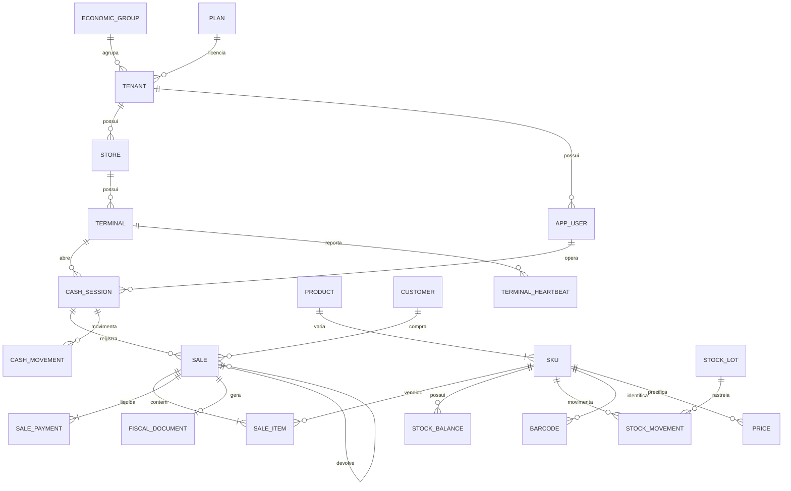

# 03 · Modelo de Dados

> PostgreSQL 16. Convenções: `snake_case`; PK `uuid` (v7, ordenável por tempo — bom para índice);
> **dinheiro sempre em `bigint` de centavos**; quantidade em `numeric(14,4)` (peso de sorvete exige
> casas decimais); timestamps em `timestamptz` (UTC); `tenant_id` em **toda** tabela de negócio.

## 1. Visão geral do modelo



## 2. Multiempresa, licenciamento e planos

O tenant **é o CNPJ**. Grupo econômico só agrega para leitura gerencial (D4).

```sql
CREATE TABLE economic_group (
  id            uuid PRIMARY KEY,
  name          text NOT NULL,
  created_at    timestamptz NOT NULL DEFAULT now()
);

CREATE TABLE plan (
  id            uuid PRIMARY KEY,
  code          text NOT NULL UNIQUE,              -- 'basico' | 'ideal' | 'completo'
  name          text NOT NULL,
  monthly_cents bigint NOT NULL,
  features      jsonb NOT NULL,                    -- {"fiscal":true,"grade":false,"delivery":false,...}
  limits        jsonb NOT NULL,                    -- {"terminals":1,"users":5,"invoices_month":3000,"stores":1}
  overage       jsonb NOT NULL DEFAULT '{}',       -- {"invoice_cents":150}  -- R$1,50 por nota excedente
  active        boolean NOT NULL DEFAULT true
);

CREATE TABLE tenant (
  id                uuid PRIMARY KEY,
  economic_group_id uuid REFERENCES economic_group(id),
  plan_id           uuid NOT NULL REFERENCES plan(id),
  legal_name        text NOT NULL,                 -- razão social
  trade_name        text NOT NULL,                 -- nome fantasia
  cnpj              char(14) NOT NULL UNIQUE,      -- 1 licença = 1 CNPJ
  ie                text,                          -- inscrição estadual
  im                text,                          -- inscrição municipal
  tax_regime        text NOT NULL,                 -- 'simples' | 'presumido' | 'real'
  crt               smallint NOT NULL,             -- código de regime tributário (fiscal)
  address           jsonb NOT NULL,
  status            text NOT NULL DEFAULT 'trial', -- trial | active | past_due | suspended | cancelled
  suspended_at      timestamptz,
  grace_until       timestamptz,                   -- tolerância antes de virar somente leitura
  timezone          text NOT NULL DEFAULT 'America/Sao_Paulo',
  created_at        timestamptz NOT NULL DEFAULT now()
);

-- Override pontual de feature/limite sem trocar o plano (negociação comercial)
CREATE TABLE tenant_entitlement (
  tenant_id   uuid NOT NULL REFERENCES tenant(id) ON DELETE CASCADE,
  key         text NOT NULL,                       -- 'delivery' | 'terminals' | 'invoices_month'
  value       jsonb NOT NULL,
  expires_at  timestamptz,
  PRIMARY KEY (tenant_id, key)
);

-- Medição de uso: base do faturamento e do painel da revenda (RF-19.5)
CREATE TABLE usage_counter (
  tenant_id   uuid NOT NULL,
  period      date NOT NULL,                       -- primeiro dia do mês
  metric      text NOT NULL,                       -- 'invoices' | 'terminals' | 'users' | 'sales'
  value       bigint NOT NULL DEFAULT 0,
  PRIMARY KEY (tenant_id, period, metric)
);

CREATE TABLE store (
  id          uuid PRIMARY KEY,
  tenant_id   uuid NOT NULL REFERENCES tenant(id),
  code        text NOT NULL,                       -- 'Q01', 'Q02'
  name        text NOT NULL,                       -- 'Quiosque Shopping Norte'
  kind        text NOT NULL DEFAULT 'kiosk',       -- kiosk | store | container | warehouse
  address     jsonb,
  opens_at    time, closes_at time,                -- base para o alerta de caixa fora de horário
  active      boolean NOT NULL DEFAULT true,
  UNIQUE (tenant_id, code)
);

CREATE TABLE terminal (
  id             uuid PRIMARY KEY,
  tenant_id      uuid NOT NULL REFERENCES tenant(id),
  store_id       uuid NOT NULL REFERENCES store(id),
  code           text NOT NULL,                    -- 'PDV1'
  fiscal_series  int  NOT NULL,                    -- série da NFC-e deste terminal
  device_token   text NOT NULL,                    -- pareamento do PDV/Bridge
  app_version    text,
  last_seen_at   timestamptz,
  status         text NOT NULL DEFAULT 'active',
  UNIQUE (tenant_id, store_id, code)
);
```

**Entitlement em runtime:** um `EntitlementService` resolve `plano.features` + overrides do tenant,
cacheado em Redis por 60s e invalidado por evento `tenant.plan.changed`. Guard `@RequiresFeature('delivery')`
protege rota; no front, esconde o menu. As duas coisas — bloquear no servidor é o que vale.

## 3. Identidade e permissões

```sql
CREATE TABLE app_user (
  id            uuid PRIMARY KEY,
  tenant_id     uuid NOT NULL REFERENCES tenant(id),
  name          text NOT NULL,
  email         citext,
  password_hash text,                       -- argon2id
  pin_hash      text,                       -- login rápido no PDV
  status        text NOT NULL DEFAULT 'active',
  last_login_at timestamptz,
  UNIQUE (tenant_id, email)
);

CREATE TABLE role (
  id          uuid PRIMARY KEY,
  tenant_id   uuid REFERENCES tenant(id),   -- NULL = papel de sistema
  code        text NOT NULL,                -- owner|admin|gerente|caixa|estoquista|financeiro|contador|suporte
  permissions text[] NOT NULL               -- ['sale.create','sale.discount.above_limit','cash.close', ...]
);

CREATE TABLE user_role (
  user_id  uuid NOT NULL REFERENCES app_user(id) ON DELETE CASCADE,
  role_id  uuid NOT NULL REFERENCES role(id),
  store_id uuid REFERENCES store(id),       -- NULL = todas as lojas do tenant
  PRIMARY KEY (user_id, role_id, COALESCE(store_id, '00000000-0000-0000-0000-000000000000'::uuid))
);

-- Auditoria append-only: sem UPDATE, sem DELETE (garantido por trigger + permissão de role no banco)
CREATE TABLE audit_log (
  id          bigserial PRIMARY KEY,
  tenant_id   uuid NOT NULL,
  user_id     uuid,
  store_id    uuid,
  action      text NOT NULL,                -- 'sale.cancel', 'price.update', 'tenant.impersonate'
  entity      text NOT NULL,
  entity_id   text,
  before      jsonb,
  after       jsonb,
  reason      text,
  ip          inet,
  created_at  timestamptz NOT NULL DEFAULT now()
) PARTITION BY RANGE (created_at);
```

## 4. Catálogo, grade e preço

Regra central: **vende-se SKU, nunca produto-pai** (RF-10.4). Produto simples também tem um SKU —
sem exceção no código.

```sql
CREATE TABLE product (
  id            uuid PRIMARY KEY,
  tenant_id     uuid NOT NULL,
  category_id   uuid,
  name          text NOT NULL,
  kind          text NOT NULL DEFAULT 'simple',   -- simple | grid | combo | service | ingredient
  unit          text NOT NULL DEFAULT 'UN',       -- UN | KG | L
  sold_by_weight boolean NOT NULL DEFAULT false,  -- sorvete/açaí no peso
  -- fiscal (herdado pelos SKUs)
  ncm           char(8), cest char(7), origin smallint NOT NULL DEFAULT 0,
  cfop_internal char(4), tax_profile_id uuid,
  active        boolean NOT NULL DEFAULT true
);

-- Eixos da grade: no máximo 2 (ex.: Sabor × Tamanho)
CREATE TABLE variant_axis  (id uuid PRIMARY KEY, tenant_id uuid NOT NULL, name text NOT NULL);
CREATE TABLE variant_value (id uuid PRIMARY KEY, axis_id uuid NOT NULL REFERENCES variant_axis(id),
                            value text NOT NULL, sort_order int NOT NULL DEFAULT 0);

CREATE TABLE sku (
  id            uuid PRIMARY KEY,
  tenant_id     uuid NOT NULL,
  product_id    uuid NOT NULL REFERENCES product(id),
  code          text NOT NULL,                    -- código interno
  axis1_value_id uuid REFERENCES variant_value(id),
  axis2_value_id uuid REFERENCES variant_value(id),
  description   text NOT NULL,                    -- "Sorvete Napolitano 1L"
  avg_cost_cents bigint NOT NULL DEFAULT 0,       -- custo médio do tenant
  track_lot     boolean NOT NULL DEFAULT false,
  min_stock     numeric(14,4) NOT NULL DEFAULT 0,
  active        boolean NOT NULL DEFAULT true,
  UNIQUE (tenant_id, code),
  UNIQUE (tenant_id, product_id, axis1_value_id, axis2_value_id)
);

CREATE TABLE barcode (
  tenant_id uuid NOT NULL,
  code      text NOT NULL,          -- EAN-13, EAN-8, DUN-14 ou código de balança
  sku_id    uuid NOT NULL REFERENCES sku(id),
  kind      text NOT NULL DEFAULT 'ean',  -- ean | scale_weight | scale_price | internal
  PRIMARY KEY (tenant_id, code)
);

-- Preço por loja e vigência. Nunca se altera preço em cima: cria-se nova vigência.
CREATE TABLE price (
  id          uuid PRIMARY KEY,
  tenant_id   uuid NOT NULL,
  sku_id      uuid NOT NULL REFERENCES sku(id),
  store_id    uuid,                             -- NULL = preço padrão do tenant
  price_cents bigint NOT NULL,                  -- por unidade OU por kg, conforme product.unit
  valid_from  timestamptz NOT NULL DEFAULT now(),
  valid_to    timestamptz
);
CREATE INDEX ON price (tenant_id, sku_id, store_id, valid_from DESC);
```

### 4.1 Código de barras de balança (essencial para sorvete/açaí)

A balança de balcão imprime EAN-13 com prefixo `2`, carregando **peso** ou **valor** no próprio código:

```
2 CCCCC PPPPP D     → 2 + código do item (5) + peso em gramas (5) + dígito verificador
2 CCCCC VVVVV D     → 2 + código do item (5) + valor em centavos (5) + dígito verificador
```

`barcode.kind` diz qual layout usar. A configuração de máscara fica em `store.settings.scale_barcode`,
porque varia por balança. **Isso precisa ser testado com a balança real do quiosque antes do rollout** —
é a fonte clássica de erro de valor no varejo de peso.

## 5. Estoque

```sql
CREATE TABLE stock_lot (
  id           uuid PRIMARY KEY,
  tenant_id    uuid NOT NULL,
  sku_id       uuid NOT NULL REFERENCES sku(id),
  lot_code     text NOT NULL,
  expires_at   date,
  UNIQUE (tenant_id, sku_id, lot_code)
);

-- Saldo materializado (leitura rápida no PDV); a verdade é o somatório dos movimentos
CREATE TABLE stock_balance (
  tenant_id  uuid NOT NULL,
  store_id   uuid NOT NULL,
  sku_id     uuid NOT NULL,
  lot_id     uuid,
  quantity   numeric(14,4) NOT NULL DEFAULT 0,
  reserved   numeric(14,4) NOT NULL DEFAULT 0,
  updated_at timestamptz NOT NULL DEFAULT now(),
  PRIMARY KEY (tenant_id, store_id, sku_id, COALESCE(lot_id,'00000000-0000-0000-0000-000000000000'::uuid))
);

CREATE TABLE stock_movement (
  id           uuid PRIMARY KEY,
  tenant_id    uuid NOT NULL,
  store_id     uuid NOT NULL,
  sku_id       uuid NOT NULL,
  lot_id       uuid,
  kind         text NOT NULL,      -- sale | return | purchase | adjust | transfer_in | transfer_out | production_in | production_out | loss
  quantity     numeric(14,4) NOT NULL,   -- + entrada, − saída
  unit_cost_cents bigint NOT NULL DEFAULT 0,
  ref_type     text, ref_id uuid,        -- venda, compra, inventário que originou
  reason       text,
  user_id      uuid,
  occurred_at  timestamptz NOT NULL DEFAULT now()
) PARTITION BY RANGE (occurred_at);
```

**Consumo FEFO** (RN-04): ao baixar um SKU com `track_lot`, o serviço escolhe os lotes por
`expires_at ASC`, podendo dividir a baixa entre lotes. Lote vencido é ignorado e, se for a única
opção, a venda **bloqueia** com mensagem clara. Sorvete tem validade — isso não é decoração.

## 6. Caixa e venda

```sql
CREATE TABLE cash_session (
  id                uuid PRIMARY KEY,
  tenant_id         uuid NOT NULL,
  store_id          uuid NOT NULL,
  terminal_id       uuid NOT NULL,
  opened_by         uuid NOT NULL,
  opened_at         timestamptz NOT NULL,
  opening_float_cents bigint NOT NULL DEFAULT 0,
  closed_by         uuid,
  closed_at         timestamptz,
  counted           jsonb,      -- {"cash":128050,"credit":94000,...} conferência cega
  expected          jsonb,      -- calculado pelo sistema
  difference_cents  bigint,
  status            text NOT NULL DEFAULT 'open',   -- open | closing | closed
  notes             text
);

CREATE TABLE cash_movement (
  id           uuid PRIMARY KEY,
  tenant_id    uuid NOT NULL,
  session_id   uuid NOT NULL REFERENCES cash_session(id),
  kind         text NOT NULL,        -- withdrawal (sangria) | supply (suprimento) | reinforcement
  amount_cents bigint NOT NULL,
  reason       text NOT NULL,
  user_id      uuid NOT NULL,
  approved_by  uuid,
  occurred_at  timestamptz NOT NULL DEFAULT now()
);

-- ID vem do PDV (UUID v7) → é a chave de idempotência da sincronização
CREATE TABLE sale (
  id                uuid PRIMARY KEY,
  tenant_id         uuid NOT NULL,
  store_id          uuid NOT NULL,
  terminal_id       uuid NOT NULL,
  session_id        uuid NOT NULL,
  number            bigint NOT NULL,          -- sequencial por loja, atribuído no servidor
  customer_id       uuid,
  customer_document char(11),                 -- CPF na nota
  operator_id       uuid NOT NULL,
  salesperson_id    uuid,
  status            text NOT NULL,            -- completed | cancelled | returned | partially_returned
  gross_cents       bigint NOT NULL,
  discount_cents    bigint NOT NULL DEFAULT 0,
  total_cents       bigint NOT NULL,
  cost_cents        bigint NOT NULL DEFAULT 0,-- custo no momento da venda (margem histórica)
  channel           text NOT NULL DEFAULT 'pos', -- pos | kiosk | delivery | table
  original_sale_id  uuid REFERENCES sale(id), -- devolução aponta a venda de origem
  occurred_at       timestamptz NOT NULL,     -- relógio do PDV
  received_at       timestamptz NOT NULL DEFAULT now(), -- relógio do servidor
  clock_skew_ms     integer,
  UNIQUE (tenant_id, store_id, number)
) PARTITION BY RANGE (occurred_at);

CREATE TABLE sale_item (
  id             uuid PRIMARY KEY,
  tenant_id      uuid NOT NULL,
  sale_id        uuid NOT NULL REFERENCES sale(id),
  line_number    int  NOT NULL,
  sku_id         uuid NOT NULL,
  lot_id         uuid,
  description    text NOT NULL,        -- congelado no momento da venda
  quantity       numeric(14,4) NOT NULL,
  unit           text NOT NULL,
  unit_price_cents bigint NOT NULL,    -- preço praticado (RN-03)
  discount_cents bigint NOT NULL DEFAULT 0,
  total_cents    bigint NOT NULL,
  unit_cost_cents bigint NOT NULL DEFAULT 0,
  tax_snapshot   jsonb,                -- NCM, CST, alíquotas usadas na nota
  weighed        boolean NOT NULL DEFAULT false,  -- veio da balança
  returned_qty   numeric(14,4) NOT NULL DEFAULT 0
);

CREATE TABLE sale_payment (
  id             uuid PRIMARY KEY,
  tenant_id      uuid NOT NULL,
  sale_id        uuid NOT NULL REFERENCES sale(id),
  method         text NOT NULL,        -- cash | credit | debit | pix | voucher | store_credit
  amount_cents   bigint NOT NULL,
  change_cents   bigint NOT NULL DEFAULT 0,
  -- v1 (maquininha avulsa): informado pelo operador. F3 (TEF): capturado do pinpad.
  captured       boolean NOT NULL DEFAULT false,
  acquirer       text,                 -- stone | cielo | rede | getnet
  card_brand     text,                 -- visa | master | elo | amex
  installments   smallint NOT NULL DEFAULT 1,
  nsu            text,
  authorization_code text,
  transaction_id uuid                  -- FK para payment_transaction quando houver TEF
);
```

> **Detalhe que decide a conciliação:** `sale_payment.captured = false` na v1 marca que o dado veio
> do atendente, não da adquirente. O módulo de recebíveis usa isso para conciliar por aproximação e
> para medir a taxa de erro de digitação — número que justifica (ou não) investir no TEF na F3.

## 7. Fiscal

```sql
CREATE TABLE fiscal_document (
  id              uuid PRIMARY KEY,
  tenant_id       uuid NOT NULL,
  store_id        uuid NOT NULL,
  sale_id         uuid REFERENCES sale(id),
  model           smallint NOT NULL,        -- 65 = NFC-e, 55 = NF-e
  series          int NOT NULL,
  number          bigint,                   -- devolvido pelo gateway
  access_key      char(44) UNIQUE,
  status          text NOT NULL,            -- queued|sending|authorized|rejected|cancelled|denied|contingency
  provider        text NOT NULL,            -- focus | plugnotas | tecnospeed | nfeio
  provider_ref    text,                     -- id do documento no provedor
  environment     smallint NOT NULL,        -- 1 produção, 2 homologação
  protocol        text,
  authorized_at   timestamptz,
  rejection_code  text,
  rejection_msg   text,
  attempts        int NOT NULL DEFAULT 0,
  next_attempt_at timestamptz,
  xml_url         text,                     -- object storage
  danfe_url       text,
  qr_code         text,
  payload         jsonb NOT NULL,           -- o que enviamos (auditoria e reenvio)
  created_at      timestamptz NOT NULL DEFAULT now()
);
CREATE INDEX ON fiscal_document (tenant_id, status, next_attempt_at);
CREATE INDEX ON fiscal_document (tenant_id, store_id, authorized_at DESC);

CREATE TABLE fiscal_event (          -- cancelamento, CC-e, inutilização
  id            uuid PRIMARY KEY,
  tenant_id     uuid NOT NULL,
  document_id   uuid NOT NULL REFERENCES fiscal_document(id),
  kind          text NOT NULL,       -- cancel | correction | inutilize
  reason        text NOT NULL,
  status        text NOT NULL,
  protocol      text,
  xml_url       text,
  created_at    timestamptz NOT NULL DEFAULT now()
);

CREATE TABLE tax_profile (           -- perfil tributário reaproveitável entre produtos
  id          uuid PRIMARY KEY,
  tenant_id   uuid NOT NULL,
  name        text NOT NULL,         -- 'Sorvete 12% MVA', 'Bebida ST'
  rules       jsonb NOT NULL         -- por UF/CFOP: CST/CSOSN, alíquotas ICMS/PIS/COFINS
);
```

## 8. Financeiro e recebíveis (F2/F3)

```sql
CREATE TABLE card_contract (
  id            uuid PRIMARY KEY,
  tenant_id     uuid NOT NULL,
  acquirer      text NOT NULL,
  brand         text NOT NULL,
  product       text NOT NULL,       -- debit | credit | credit_installment
  installments_from smallint NOT NULL DEFAULT 1,
  installments_to   smallint NOT NULL DEFAULT 1,
  rate_percent  numeric(6,4) NOT NULL,
  fixed_cents   bigint NOT NULL DEFAULT 0,
  settlement_days smallint NOT NULL,
  valid_from    date NOT NULL,
  valid_to      date
);

CREATE TABLE receivable (
  id                uuid PRIMARY KEY,
  tenant_id         uuid NOT NULL,
  store_id          uuid NOT NULL,
  sale_payment_id   uuid REFERENCES sale_payment(id),
  installment       smallint NOT NULL DEFAULT 1,
  gross_cents       bigint NOT NULL,
  fee_cents         bigint NOT NULL,
  net_cents         bigint NOT NULL,
  expected_date     date NOT NULL,
  settled_date      date,
  settled_cents     bigint,
  status            text NOT NULL DEFAULT 'expected', -- expected|settled|divergent|anticipated|not_received
  divergence_reason text
);

CREATE TABLE bank_account (
  id uuid PRIMARY KEY, tenant_id uuid NOT NULL, bank_code text, agency text,
  account text, name text NOT NULL, opening_balance_cents bigint NOT NULL DEFAULT 0
);

CREATE TABLE bank_statement_line (
  id uuid PRIMARY KEY, tenant_id uuid NOT NULL, account_id uuid NOT NULL REFERENCES bank_account(id),
  fit_id text, occurred_on date NOT NULL, amount_cents bigint NOT NULL, description text,
  reconciled_with uuid, reconciled_at timestamptz, UNIQUE (tenant_id, account_id, fit_id)
);

CREATE TABLE payable   (id uuid PRIMARY KEY, tenant_id uuid NOT NULL, supplier_id uuid,
  due_on date NOT NULL, amount_cents bigint NOT NULL, paid_cents bigint NOT NULL DEFAULT 0,
  cost_center_id uuid, account_id uuid, doc_ref text, status text NOT NULL DEFAULT 'open');
```

## 9. Telemetria e performance do PDV (RF-20)

```sql
CREATE TABLE terminal_heartbeat (
  tenant_id        uuid NOT NULL,
  terminal_id      uuid NOT NULL,
  at               timestamptz NOT NULL,
  app_version      text,
  online           boolean NOT NULL,
  pending_sales    int NOT NULL DEFAULT 0,   -- outbox do PDV
  fiscal_queue     int NOT NULL DEFAULT 0,
  printer_ok       boolean,
  scale_ok         boolean,
  bridge_version   text,
  disk_free_mb     int,
  last_sale_at     timestamptz,
  PRIMARY KEY (tenant_id, terminal_id, at)
) PARTITION BY RANGE (at);

CREATE TABLE terminal_alert (
  id uuid PRIMARY KEY, tenant_id uuid NOT NULL, terminal_id uuid NOT NULL,
  kind text NOT NULL,        -- offline | unsynced_sales | fiscal_stuck | printer_down | cash_open_after_hours
  severity text NOT NULL,    -- info | warning | critical
  opened_at timestamptz NOT NULL DEFAULT now(), resolved_at timestamptz, details jsonb
);

-- Agregado por faixa de 30min: alimenta curva de horário e o dashboard ao vivo (RF-20.1/20.3)
CREATE MATERIALIZED VIEW sales_by_slot AS
SELECT tenant_id, store_id,
       date_trunc('hour', occurred_at)
         + floor(extract(minute FROM occurred_at)/30) * interval '30 min' AS slot,
       count(*)                       AS sales_count,
       sum(total_cents)               AS revenue_cents,
       sum(total_cents)/count(*)      AS avg_ticket_cents,
       sum(total_cents - cost_cents)  AS margin_cents
FROM sale WHERE status = 'completed'
GROUP BY 1,2,3;
CREATE UNIQUE INDEX ON sales_by_slot (tenant_id, store_id, slot);
```

> **O dado do dia não vem da view.** O painel ao vivo lê contadores incrementais em Redis
> (atualizados pelo evento `sale.finalized`) e cai para o Postgres em qualquer período histórico.
> A materialized view é atualizada de forma incremental a cada 5 min pelo worker de analytics.

## 10. Isolamento por tenant no banco (RLS)

Padrão aplicado a **toda** tabela com `tenant_id`, gerado por script para não depender de disciplina:

```sql
ALTER TABLE sale ENABLE ROW LEVEL SECURITY;
ALTER TABLE sale FORCE ROW LEVEL SECURITY;   -- vale inclusive para o dono da tabela

CREATE POLICY tenant_isolation ON sale
  USING      (tenant_id = current_setting('app.tenant_id', true)::uuid)
  WITH CHECK (tenant_id = current_setting('app.tenant_id', true)::uuid);
```

A aplicação executa `SET LOCAL app.tenant_id = '<uuid>'` na abertura de cada transação. Os workers,
que processam vários tenants, fazem o mesmo por item da fila — **nunca** rodam com role que ignora RLS.
Consulta de grupo econômico usa uma role específica com política `tenant_id = ANY(current_setting('app.tenant_ids'))`.

## 11. Particionamento e volume

| Tabela | Estratégia | Motivo |
|--------|-----------|--------|
| `sale`, `sale_item`, `sale_payment` | RANGE mensal em `occurred_at` | Consulta é quase sempre do período recente; expurgo e vacuum baratos |
| `stock_movement` | RANGE mensal | Cresce mais rápido que tudo |
| `terminal_heartbeat` | RANGE **semanal**, retenção de 90 dias | Alto volume, valor curto |
| `audit_log` | RANGE mensal, retenção de 5 anos | Exigência legal e de auditoria |
| `fiscal_document` | Sem partição inicial; XML no object storage | Linha é pequena; o peso está no arquivo |

Criação e expurgo de partição por job mensal (`pg_partman` ou script próprio) — **com alerta se falhar**,
porque partição faltando derruba a inserção de venda.

## 12. Índices que não podem faltar

```sql
CREATE INDEX ON sale (tenant_id, store_id, occurred_at DESC);
CREATE INDEX ON sale (tenant_id, session_id);
CREATE INDEX ON sale_item (tenant_id, sku_id);
CREATE INDEX ON stock_movement (tenant_id, store_id, sku_id, occurred_at DESC);
CREATE INDEX ON stock_balance (tenant_id, store_id) INCLUDE (sku_id, quantity);
CREATE INDEX ON sku (tenant_id, active) WHERE active;
CREATE INDEX ON app_user (tenant_id, status);
CREATE INDEX ON receivable (tenant_id, expected_date, status);
-- busca de produto por nome no PDV (acentos e erro de digitação)
CREATE EXTENSION IF NOT EXISTS pg_trgm;
CREATE EXTENSION IF NOT EXISTS unaccent;
CREATE INDEX ON sku USING gin (unaccent(description) gin_trgm_ops);
```

## 13. Pontos que o time precisa validar

| # | Ponto | Pergunta |
|---|-------|----------|
| D1 | Dois eixos de grade | Sorvete precisa de um terceiro eixo (ex.: sabor × tamanho × embalagem)? |
| D2 | `numeric(14,4)` para quantidade | 4 casas bastam para peso, ou a balança entrega mais precisão? |
| D3 | Saldo materializado | Aceitamos reconciliação noturna de `stock_balance` contra o somatório de movimentos? |
| D4 | Sequencial de venda no servidor | Como numerar venda criada offline: sequencial local por terminal + global no servidor? |
| D5 | Retenção de heartbeat | 90 dias resolve para investigar problema recorrente de terminal? |
| D6 | Custo médio por tenant ou por loja | Quiosques compram junto; custo médio único por tenant é suficiente? |
