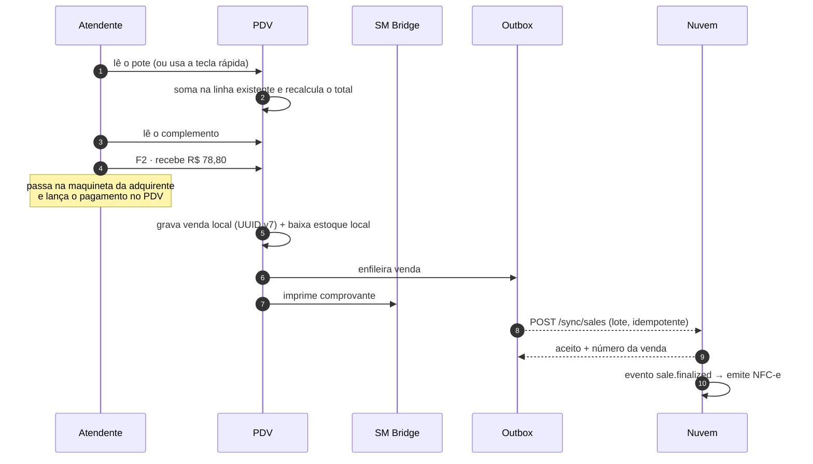
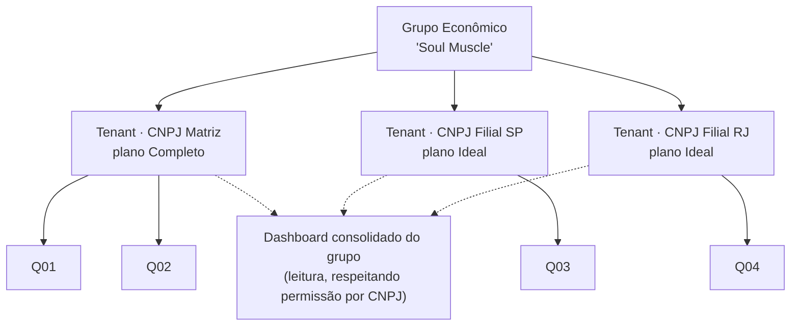
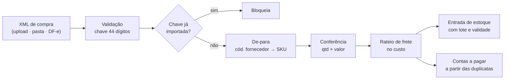
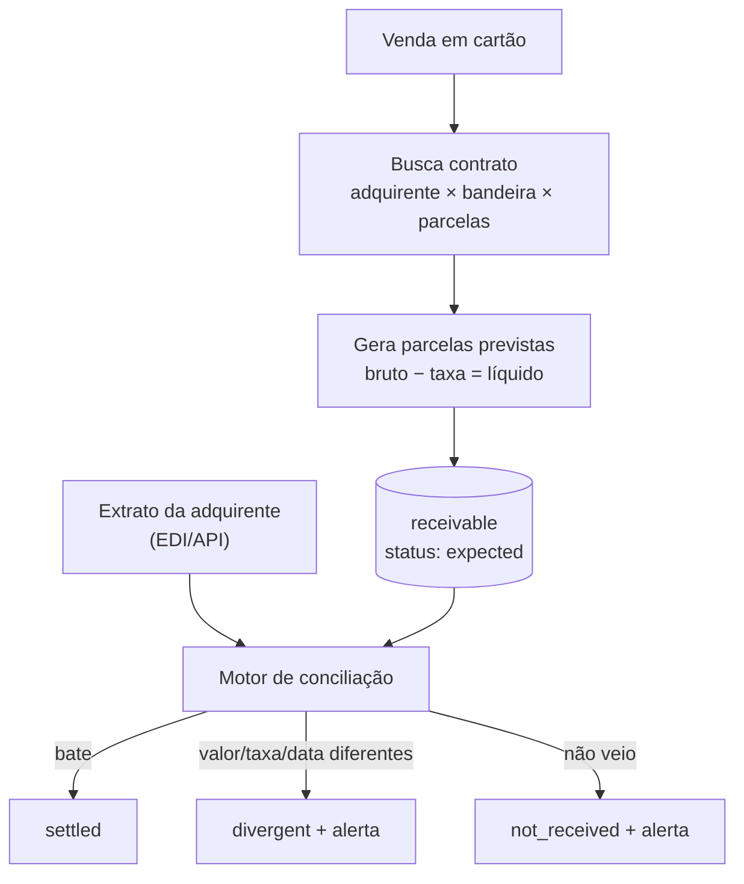

# 04 · Módulos Funcionais

Detalhamento por módulo: o que faz, telas, fluxos e o que precisa ficar decidido antes de codificar.

---

## 1. `pos` — Frente de caixa (F1)

### 1.1 Telas

| Tela | Conteúdo |
|------|----------|
| **Abertura de caixa** | Operador, terminal, fundo de troco, conferência da última sessão |
| **Venda** | Carrinho (70% da tela), busca/leitura, teclas rápidas de produto, ajuste de quantidade, total gigante |
| **Pagamento** | Meios múltiplos, calculadora de troco, atalhos (F1 dinheiro, F2 débito, F3 crédito, F4 Pix) |
| **Vendas em espera** | Lista de vendas pausadas no terminal |
| **Caixa (F9)** | Sangria e suprimento com motivo, e a lista dos movimentos do turno |
| **Fechamento** | Conferência cega: a diferença só aparece depois de enviar, e diferença sem justificativa é recusada |
| **Status** | Sincronização, fila fiscal, dispositivos — o mesmo que o dono vê no painel |

### 1.2 Fluxo da venda (o caso mais comum do quiosque)



### 1.3 Regras de tela que não são negociáveis

- Nenhum fluxo exige mouse. Todo atalho é tecla física.
- Total sempre visível, em fonte grande — o atendente confere de longe.
- Erro de dispositivo aparece como **faixa amarela**, nunca como modal que trava a venda.
- Botão de cancelar item pede motivo só quando exigir permissão — não atrapalha o dia a dia.
- Offline não é tela de erro: é um **selo discreto** "offline · 3 vendas na fila".

---

## 2. `fiscal` — Emissão via gateway (F1)

Detalhado em [06-FISCAL](./06-FISCAL.md). Resumo do papel do módulo:

- Monta o payload fiscal a partir da venda (dados do emitente, itens, tributos, pagamentos).
- Enfileira em BullMQ (`fiscal:emit`) com retentativa exponencial: 5s, 30s, 2min, 10min, 1h.
- Fala com o gateway por um **adaptador** (`FiscalProvider`), nunca direto.
- Recebe webhook de autorização/rejeição, guarda XML e DANFE no object storage.
- Classifica rejeição em **transitória** (reenvia sozinho) e **definitiva** (fila de correção humana).
- Publica `fiscal.document.authorized` → cupom vai por link ao cliente e o DANFE fica disponível.

---

## 3. `analytics` + `telemetry` — Performance e saúde do PDV (F1)

Este é o módulo que atende o pedido explícito do dono: **controlar a performance do PDV**.

### 3.1 Dashboard ao vivo (RF-20.1)

```
┌─ HOJE · Rede Soul Muscle ──────────────────────── 14:32 ● ao vivo ─┐
│  R$ 12.847      312 vendas      R$ 41,17       +18% vs. sáb. ant.  │
│  faturamento    transações      ticket médio                        │
├─────────────────────────────────────────────────────────────────────┤
│  QUIOSQUE          FATURAMENTO   VENDAS   TICKET   META    STATUS   │
│  Q01 Shop. Norte   R$ 5.240      128      41,00    87% ▓▓▓▓▓▓▓░  ●  │
│  Q02 Shop. Sul     R$ 4.180      102      40,98    76% ▓▓▓▓▓▓░░  ●  │
│  Q03 Centro        R$ 3.427       82      41,79    93% ▓▓▓▓▓▓▓▓  ⚠  │
│                                              Q03: 4 vendas na fila  │
└─────────────────────────────────────────────────────────────────────┘
```

Implementação: contadores incrementais em Redis por `tenant:store:data`, atualizados no evento
`sale.finalized`, e push por WebSocket. Histórico e comparativos vêm do Postgres/materialized view.

### 3.2 Curva de horário e mix (RF-20.3/20.4)

- Heatmap dia da semana × faixa de 30min, por loja — mostra onde falta ou sobra gente.
- Top produtos e **top sabores** com participação % e margem.
- Comparativo entre quiosques na mesma faixa de horário (quem converte melhor no pico).

### 3.3 Saúde do terminal (RF-20.5/20.6)

Cada PDV manda heartbeat a cada 60s (e imediatamente ao mudar de estado). O worker de telemetria
abre e fecha alertas:

| Alerta | Gatilho | Severidade |
|--------|---------|-----------|
| Terminal offline | sem heartbeat > 15min em horário de funcionamento | crítico |
| Vendas não sincronizadas | outbox > 0 há mais de 30min | crítico |
| Fila fiscal parada | documento em `queued` há > 15min ou > 3 tentativas | crítico |
| Nota rejeitada | rejeição definitiva | alto |
| Impressora fora | `printer_ok = false` por 2 heartbeats | médio |
| Caixa aberto fora de horário | aberto após `store.closes_at` + tolerância | médio |
| Versão desatualizada | app < versão mínima suportada | baixo |

Notificação por painel, e-mail e WhatsApp, com **agrupamento** — dez alertas do mesmo quiosque viram
uma mensagem, não dez.

---

## 4. `tenancy` — Multiempresa, planos e revenda (F1)

### 4.1 Estrutura



- **Licença e cobrança**: por CNPJ (tenant).
- **Grupo econômico**: apenas leitura gerencial consolidada — nunca compartilha cadastro, estoque
  ou movimento entre CNPJs (seria erro fiscal).
- **Transferência entre CNPJs** é venda/transferência com NF-e, não movimento interno.

### 4.2 Planos (mapeando a matriz original)

| Feature | Básico | Ideal | Completo |
|---------|:------:|:-----:|:--------:|
| PDV — frente de caixa | 1 | 1 | ilimitado* |
| Usuários | 3 | 10 | ilimitado* |
| Notas fiscais/mês | 500 | 3.000 | ilimitado |
| Excedente de nota | R$ 1,50 | R$ 1,50 | — |
| Vendas · Estoque · Financeiro | ✅ | ✅ | ✅ |
| Relatórios | ✅ | ✅ | ✅ |
| Performance do PDV | ✅ | ✅ | ✅ |
| Importação de XML | ❌ | ✅ | ✅ |
| Estoque em grade | ❌ | ✅ | ✅ |
| Conciliação bancária | ❌ | ❌ | ✅ |
| Contratos de cartões | ❌ | ❌ | ✅ |
| Mesas · Delivery | ❌ | ❌ | ✅ |
| Autoatendimento | ❌ | ❌ | ✅ |
| Ordem de serviço · Produção | ❌ | ❌ | ✅ |
| Relatório dinâmico | ❌ | ❌ | ✅ |

\* "ilimitado" com limite técnico de proteção configurável, para evitar abuso.

> **Valores e limites são exemplo** — a tabela sai de `plan.features`/`plan.limits`, então o
> comercial ajusta sem deploy. O que o time precisa garantir é que **toda** feature esteja atrás de
> uma chave de entitlement desde o primeiro commit; retrofitar isso depois custa caro.

### 4.3 Back-office da revenda

Aplicação separada: lista de clientes, plano e status, uso do mês (notas, terminais, usuários),
faturas, log de acesso do suporte, ativação/suspensão e ferramenta de diagnóstico do terminal.
Acesso ao tenant do cliente exige **impersonation com motivo, prazo e auditoria visível ao cliente**.

---

## 5. `catalog` + `inventory` (F1 básico · F2 completo)

- **F1**: cadastro de produto/SKU, código de barras, preço por loja com
  vigência, saldo por loja, baixa automática na venda, entrada manual, ajuste com motivo, alerta de mínimo.
- **F2**: grade (RF-10) com tela de matriz, lote e validade com FEFO, inventário por celular
  (contagem cega, divergência, aprovação), transferência entre lojas, curva ABC, sugestão de compra.

**Grade na prática (sorvete):** eixo 1 = Sabor (Napolitano, Chocolate, Flocos…), eixo 2 = Tamanho
(300ml, 500ml, 1L), cada combinação com seu preço. A tela mostra a matriz com saldo por célula e
permite lançar entrada direto na célula — é o que torna o recebimento de dezenas de sabores viável.

---

## 6. `purchasing` — Compras e importação de XML (F2)



O de-para é memorizado em `supplier_sku_map`: na segunda compra do mesmo fornecedor, a importação
vira dois cliques. Sem isso, o módulo não é usado — é a diferença entre a ferramenta pegar ou virar planilha.

---

## 7. `finance` — Financeiro (F2) e conciliações (F3)

- **Caixa**: consolidação das sessões de todas as lojas, diferença por operador, histórico.
- **Contas a pagar/receber**: com centro de custo, plano de contas, baixa parcial, juros/multa/desconto.
- **Fluxo de caixa**: realizado + projetado (inclui recebíveis de cartão previstos).
- **DRE gerencial**: por loja, por CNPJ e consolidado do grupo econômico.
- **Conciliação bancária (F3)**: importa OFX/CNAB, motor de regras com tolerância, tela de match
  lado a lado, aprendizado das escolhas do usuário.

---

## 8. `receivables` — Contratos de cartão e recebíveis (F3)



**Limitação honesta:** como o pagamento é lançado à mão, o match é por `valor + data + bandeira` e a
taxa de acerto fica em torno de 85–95% — casos ambíguos (duas vendas de mesmo valor no mesmo dia)
vão para revisão manual. Se a loja passar a digitar o NSU do comprovante da maquineta, o casamento
vira exato; é uma escolha de disciplina operacional, não de tecnologia.

---

## 9. `channels` — Totem, mesas e delivery (F4)

- **Totem**: PWA em modo quiosque, catálogo com foto, pagamento sem dinheiro, senha impressa,
  reset por inatividade, mesma fila fiscal do PDV.
- **Mesas/comandas**: mapa de mesas, comanda por cartão, transferência de item, juntar/dividir
  conta, taxa de serviço, envio ao preparo por setor.
- **Delivery**: pedido, endereço com taxa por bairro/raio, status, entregador, rota, iFood na mesma fila.

---

## 10. `operations` — Ordem de serviço e produção (F5)

- **OS**: abertura, laudo, peças e serviços, orçamento e aprovação, técnico, prazo, garantia,
  faturamento (NFS-e + NF-e de peças).
- **Produção**: ficha técnica com insumos e perda, ordem de produção, baixa de insumo e entrada do
  acabado, custo de produção, kits/combos, painel de preparo.

Para a Soul Muscle, "produção" é o que monta **kits e combos** a partir de potes e complementos: a
ficha técnica resolve o consumo de insumo (calda, granola, casquinha) que hoje some do controle.

---

## 11. `reporting` — Relatórios (F2) e relatório dinâmico (F5)

**Fixos (F2):** vendas por período/loja/operador/produto/hora, ticket médio, margem, ruptura, giro,
fiscal por competência, comissões, exportação XLSX/CSV/PDF, agendamento por e-mail.

**Dinâmico (F5):** construtor sobre um **modelo semântico** — o usuário monta o relatório escolhendo
dimensões e métricas em português; o sistema gera o SQL:

```yaml
dimensoes: [Loja, Data, Faixa de horário, Produto, Categoria, Sabor, Operador, Meio de pagamento]
metricas:
  faturamento:   { sql: "sum(total_cents)/100.0",              formato: moeda }
  vendas:        { sql: "count(*)",                            formato: inteiro }
  ticket_medio:  { sql: "sum(total_cents)/count(*)/100.0",     formato: moeda }
  margem:        { sql: "sum(total_cents - cost_cents)/100.0", formato: moeda, permissao: product.cost.view }
  itens:         { sql: "sum(quantity)",                       formato: decimal }
```

Nunca há SQL digitado pelo usuário. O gerador injeta sempre `tenant_id`, as lojas permitidas e um
`statement_timeout` — relatório do usuário não pode derrubar o banco de ninguém.

---

## 12. Entitlements — como uma feature é ligada por plano

```typescript
// Servidor: bloqueia de verdade
@Controller('delivery')
@RequiresFeature('delivery')            // 403 + código FEATURE_NOT_IN_PLAN
export class DeliveryController {}

// Cliente: esconde e oferece upgrade
const { has } = useEntitlements();
if (!has('delivery')) return <UpgradeCard feature="Delivery" plan="Completo" />;
```

Regra: **toda feature de plano nasce com a chave**. Feature entregue "sem entitlement, depois a
gente coloca" é dívida que aparece no pior momento — quando o comercial já vendeu o plano menor.
