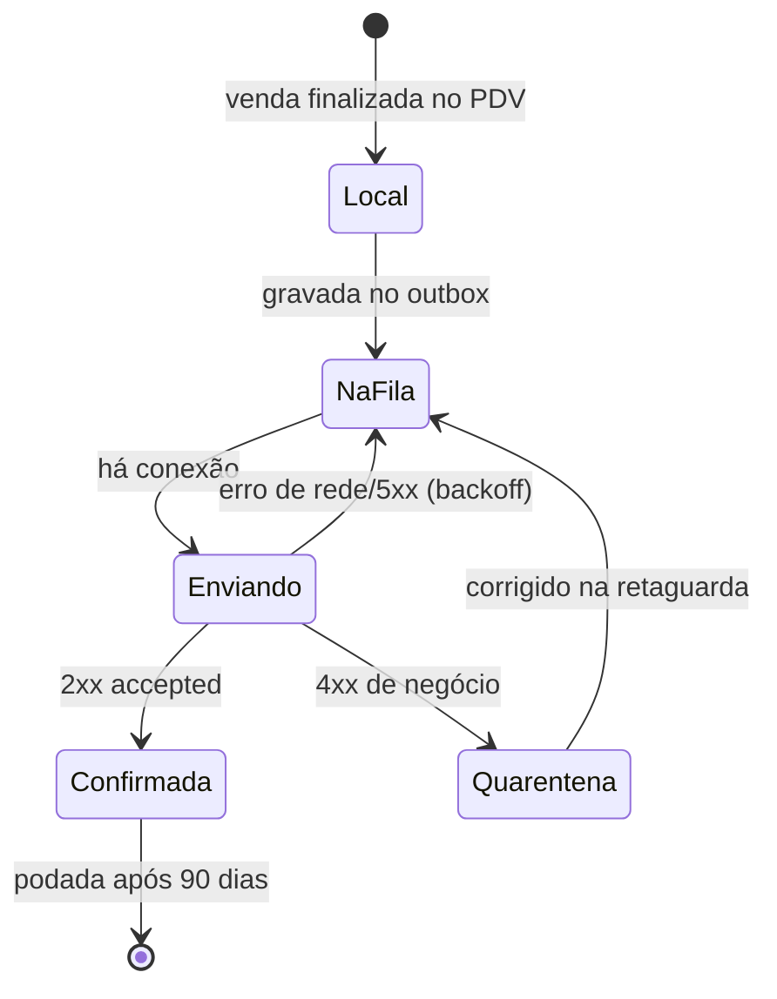

# 05 · APIs e Contratos

## 1. Convenções

| Item | Padrão |
|------|--------|
| Base | `https://api.soulerp.com.br/v1` |
| Formato | JSON, `camelCase` |
| Dinheiro | **Inteiro de centavos** (`totalCents: 2468`) — nunca `24.68` |
| Quantidade | String decimal (`"0.4120"`) para não perder precisão em peso |
| Data/hora | ISO-8601 com fuso (`2026-09-14T14:32:07-03:00`) |
| Paginação | Cursor: `?limit=50&cursor=...` → `{ data, nextCursor }` |
| Versionamento | Prefixo de caminho (`/v1`); mudança quebrando gera `/v2` com 6 meses de convívio |
| Documentação | OpenAPI 3.1 gerado do código (decorators do Nest) + tipos publicados em `packages/contracts` |
| Idempotência | Header `Idempotency-Key` em todo POST que cria fato financeiro |

### 1.1 Erro padronizado

```json
{
  "error": {
    "code": "SALE_ALREADY_SYNCED",
    "message": "Venda já sincronizada",
    "details": { "saleId": "01927f3e-...", "number": 10432 },
    "traceId": "4bf92f3577b34da6a3ce929d0e0e4736"
  }
}
```

`code` é estável e consumido por código; `message` é para humano e pode mudar. `traceId` liga a
requisição ao trace no Grafana — é o que o suporte pede ao cliente.

## 2. Autenticação

Dois tipos de credencial, propositalmente separados:

| Tipo | Quem usa | Vida | Escopo |
|------|----------|------|--------|
| **Sessão de usuário** | Retaguarda, dashboard, back-office | access 15min / refresh 30d rotativo | Permissões do papel no tenant |
| **Sessão de terminal** | PDV e SM Bridge | access 24h / refresh longo, atrelado ao `deviceToken` | Só as rotas do PDV, só a loja do terminal |

O PDV autentica **o terminal**, não a pessoa. O operador entra por PIN *dentro* da sessão do
terminal — é o que permite trocar de atendente em 2 segundos e continuar funcionando offline.

```
Authorization: Bearer <jwt>
X-Tenant-Id: <uuid>        # obrigatório para usuário com acesso a vários CNPJs do grupo
X-Terminal-Id: <uuid>      # sessões de terminal
```

Claims do JWT: `sub`, `tenantId`, `tenantIds[]` (grupo econômico), `storeIds[]`, `perms[]`,
`plan`, `features[]`. **Nunca** se confia no `tenantId` vindo do corpo da requisição.

## 3. Endpoints principais (v1)

### 3.1 PDV

| Método | Rota | Descrição |
|--------|------|-----------|
| `POST` | `/pos/terminals/pair` | Pareia terminal com código de ativação; devolve `deviceToken` |
| `GET` | `/pos/bootstrap` | Pacote inicial: catálogo, preços, usuários/PIN, config fiscal, entitlements |
| `GET` | `/pos/catalog/delta?since=` | Delta de catálogo desde a última sincronização |
| `POST` | `/pos/cash-sessions` | Abre caixa |
| `POST` | `/pos/cash-sessions/{id}/movements` | Sangria/suprimento |
| `POST` | `/pos/cash-sessions/{id}/close` | Fecha com conferência cega |
| `POST` | `/sync/sales` | **Envia lote de vendas** (idempotente) |
| `POST` | `/sync/ack` | Confirma recebimento e libera o outbox |
| `POST` | `/pos/heartbeat` | Telemetria do terminal |

### 3.2 Retaguarda

`/products` `/skus` `/prices` `/barcodes` `/stock/balances` `/stock/movements` `/stock/inventories`
`/purchases` `/purchases/import-xml` `/suppliers` `/customers` `/payables` `/receivables`
`/bank/statements` `/reconciliations` `/reports/{key}` `/fiscal/documents` `/fiscal/documents/{id}/cancel`

### 3.3 Analytics e telemetria

| Método | Rota | Descrição |
|--------|------|-----------|
| `GET` | `/analytics/live` | Números do dia por loja (lê Redis) |
| `GET` | `/analytics/sales?groupBy=store,slot&from=&to=` | Série para curva de horário |
| `GET` | `/analytics/mix?dimension=sku&top=20` | Mix de produtos/sabores |
| `GET` | `/telemetry/terminals` | Saúde de todos os terminais |
| `GET` | `/telemetry/alerts?status=open` | Alertas abertos |

### 3.4 Back-office da revenda (host separado, `/admin`)

`/admin/tenants` `/admin/tenants/{id}/plan` `/admin/tenants/{id}/suspend` `/admin/usage`
`/admin/impersonate` (exige `reason` e `expiresIn`, gera registro em auditoria visível ao cliente)

## 4. Contrato central: envio de venda

```http
POST /v1/sync/sales
Authorization: Bearer <terminal-jwt>
Idempotency-Key: 01927f3e-8c4a-7bd2-9f1e-3a5c8d2e4b71
```

```json
{
  "terminalId": "01927f3e-1111-7000-8000-000000000001",
  "sales": [{
    "id": "01927f3e-8c4a-7bd2-9f1e-3a5c8d2e4b71",
    "sessionId": "01927f3e-2222-7000-8000-000000000002",
    "occurredAt": "2026-09-14T14:32:07-03:00",
    "operatorId": "01927f3e-3333-7000-8000-000000000003",
    "customerDocument": "12345678901",
    "channel": "pos",
    "items": [
      { "lineNumber": 1, "skuId": "...", "quantity": "0.4120", "unit": "KG",
        "unitPriceCents": 5990, "discountCents": 0, "totalCents": 2468, "weighed": true },
      { "lineNumber": 2, "skuId": "...", "quantity": "1.0000", "unit": "UN",
        "unitPriceCents": 300, "discountCents": 0, "totalCents": 300, "weighed": false }
    ],
    "payments": [
      { "method": "debit", "amountCents": 2768, "captured": false,
        "acquirer": "stone", "cardBrand": "visa", "installments": 1 }
    ],
    "grossCents": 2768, "discountCents": 0, "totalCents": 2768,
    "clientVersion": "1.4.2"
  }]
}
```

**Resposta 200** (parcial é normal — um item ruim não derruba o lote):

```json
{
  "results": [
    { "id": "01927f3e-8c4a-...", "status": "accepted", "number": 10432,
      "fiscal": { "status": "queued", "documentId": "..." } }
  ],
  "rejected": [
    { "id": "01927f3e-9d5b-...", "code": "SKU_NOT_FOUND",
      "message": "SKU inexistente ou de outro tenant", "action": "quarantine" }
  ]
}
```

`action` diz ao PDV o que fazer: `retry` (volta para a fila), `quarantine` (sai da fila, vai para
uma tela de pendências) ou `discard` (duplicata já aceita antes).

## 5. Webhooks recebidos

| Origem | Rota | Verificação |
|--------|------|-------------|
| Gateway fiscal | `POST /webhooks/fiscal/{provider}` | HMAC do provedor + allowlist de IP |
| PSP Pix | `POST /webhooks/pix/{psp}` | Assinatura + mTLS quando disponível |
| iFood (F4) | `POST /webhooks/ifood` | Assinatura |

Todo webhook é **idempotente por ID do evento**, responde `200` em < 1s e processa o trabalho em
fila. Provedor que não recebe `200` rápido reenvia e vira tempestade.

## 6. Protocolo de sincronização offline



**Garantias e como são obtidas:**

| Garantia | Mecanismo |
|----------|-----------|
| Não duplicar | ID da venda gerado no PDV é PK no servidor; reenvio devolve o mesmo resultado |
| Não perder | Só sai do outbox após `2xx` **confirmado**; queda no meio reenvia |
| Ordem preservada por terminal | Envio em lote com `sequence` crescente por terminal |
| Rede ruim | Lote de até 50 vendas, backoff exponencial com *jitter*, compressão gzip |
| Relógio errado | Servidor grava `receivedAt` e calcula `clockSkewMs`; relatório usa o horário do servidor |
| Caixa não fecha sujo | `POST /close` recusa (`code: PENDING_SALES`) se o outbox não estiver vazio |

**Descida de dados (nuvem → PDV):** delta por `updatedAt` a cada 5 min e por push do WebSocket
quando houver mudança de preço. O PDV **nunca** envia cadastro para cima — não existe conflito
de merge por construção.

## 7. Tempo real (WebSocket)

```
/ws?token=<jwt>
  → canal tenant:{id}:analytics   { salesCount, revenueCents, avgTicketCents, byStore[] }
  → canal tenant:{id}:terminals   { terminalId, online, pendingSales, printerOk, scaleOk }
  → canal tenant:{id}:fiscal      { documentId, status, rejectionMsg }
  → canal terminal:{id}:commands  { type: "sync_now" | "update_app" | "reload_catalog" }
```

O canal de comandos permite que o suporte mande o terminal sincronizar ou atualizar sem ligar para o
quiosque — é o que economiza a maior parte do atendimento.

## 8. Limites e proteções

| Rota | Limite |
|------|--------|
| `/auth/*` | 10 req/min por IP; bloqueio progressivo |
| `/sync/sales` | 60 req/min por terminal; lote máximo de 50 vendas |
| `/pos/heartbeat` | 2 req/min por terminal |
| Relatórios | 10 req/min por usuário; `statement_timeout` de 30s |
| Payload | 5 MB (exceto upload de XML: 20 MB) |

## 9. API pública para clientes (F3+)

Chave de API por tenant, escopos de leitura/escrita, webhooks de saída (`sale.created`,
`stock.changed`, `fiscal.authorized`) para integrar e-commerce e BI do cliente. Fica atrás de
entitlement do plano Completo. Sai **depois** que o núcleo estabilizar — API pública é contrato que
não se quebra depois.
