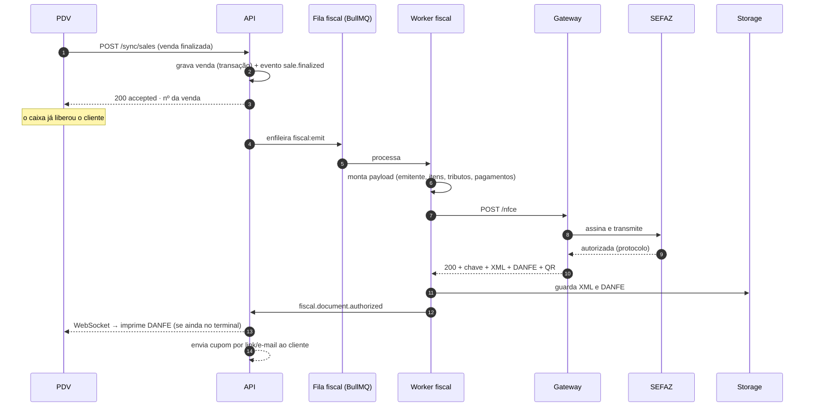
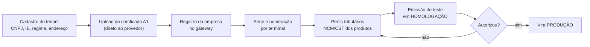

# 06 · Emissão Fiscal via Gateway de Terceiros

> **Decisão do negócio (D3):** a emissão será feita por **API de integração de terceiro**, para que
> ninguém da equipe precise configurar nada junto à Receita Federal ou à SEFAZ. Este documento define
> como isso é implementado, quais são os limites reais dessa escolha e qual provedor recomendamos.

## 1. O que o gateway faz por nós — e o que continua sendo nosso

| Responsabilidade | Gateway | Nós |
|------------------|:-------:|:---:|
| Custódia do certificado digital A1 | ✅ | — |
| Assinatura digital do XML | ✅ | — |
| Comunicação com a SEFAZ de cada UF | ✅ | — |
| Retentativa em indisponibilidade da SEFAZ | ✅ | — |
| Geração do DANFE/PDF e do QR Code | ✅ | — |
| Guarda legal do XML | ✅ (também) | ✅ (cópia própria) |
| **Cálculo correto dos tributos do item** | parcial | ✅ |
| **Cadastro fiscal correto (NCM, CEST, CST/CSOSN, CFOP)** | — | ✅ |
| **Dados do emitente por CNPJ** | — | ✅ |
| **Numeração e série por terminal** | parcial | ✅ |
| **Fila, reprocessamento e correção de rejeição** | — | ✅ |
| **Guarda de 5 anos acessível ao contador do cliente** | — | ✅ |

**Ponto que costuma surpreender:** o gateway tira o trabalho de *infraestrutura* fiscal, não o de
*parametrização* fiscal. Cadastro errado de NCM ou CST continua gerando rejeição — e a rejeição
chega para nós, não para o provedor. Por isso o módulo `fiscal` tem tela de fila de correção e o
cadastro de produto tem validação de NCM na entrada.

## 2. Camada anticorrupção

O provedor fica atrás de uma interface nossa. Trocar de provedor não pode encostar no PDV (RNF-11):

```typescript
// packages/contracts/fiscal.ts
export interface FiscalProvider {
  readonly name: 'focus' | 'plugnotas' | 'tecnospeed' | 'nfeio';
  issue(input: FiscalIssueInput): Promise<FiscalIssueResult>;   // NFC-e / NF-e
  cancel(ref: string, reason: string): Promise<FiscalEventResult>;
  correct(ref: string, text: string): Promise<FiscalEventResult>;
  inutilize(range: NumberRange, reason: string): Promise<FiscalEventResult>;
  status(ref: string): Promise<FiscalStatus>;
  fetchXml(ref: string): Promise<Buffer>;
  fetchDanfe(ref: string): Promise<Buffer>;
  registerCompany(input: CompanyFiscalConfig): Promise<string>; // onboarding do CNPJ
  parseWebhook(raw: unknown, signature: string): FiscalWebhookEvent;
}
```

Cada provedor implementa em `apps/api/src/fiscal/providers/*`. Existe um `FakeFiscalProvider` para
teste automatizado — nenhum teste do PDV depende de rede externa. **Testes de contrato** rodam o
mesmo conjunto de casos contra todos os adaptadores.

## 3. Fluxo de emissão



**A venda nunca espera a nota (A2).** O caixa fecha a venda em < 1s; a nota é autorizada em segundo
plano, tipicamente em 2–5s.

## 4. Tratamento de rejeição

| Classe | Exemplos | Ação automática |
|--------|----------|-----------------|
| **Transitória** | SEFAZ fora do ar, timeout, "serviço paralisado" | Retentativa: 5s → 30s → 2min → 10min → 1h (até 24h) |
| **Corrigível pelo cadastro** | NCM inválido, CST incompatível, CFOP errado | Vai para **fila de correção**; corrigido o cadastro, reenvia com 1 clique |
| **Corrigível pelos dados da venda** | CPF inválido, total divergente | Fila de correção com o campo destacado |
| **Definitiva** | Certificado vencido, CNPJ irregular, IE inapta | Alerta crítico ao cliente **e** à revenda; bloqueia o fechamento contábil do dia (RN-06), nunca a venda |
| **Duplicidade** | Chave já autorizada | Reconcilia: busca o documento existente e vincula à venda |

Toda rejeição vira métrica: `fiscal_rejections_total{code}` — se um código dispara, é erro de
cadastro sistêmico, não azar.

## 5. Contingência — o ponto mais delicado do projeto

### 5.1 O problema, dito com clareza

A NFC-e é autorizada **antes** da entrega da mercadoria. Com o certificado custodiado na nuvem do
provedor, **sem internet não há como obter autorização nem assinar localmente**. A contingência
offline prevista na legislação exige assinatura local do XML — algo que, num modelo 100% cloud,
o PDV não consegue fazer sozinho.

Ou seja: a decisão D3 (gateway em nuvem) e o requisito O2 (vender offline) **se tensionam**. Este é
o principal ponto de arquitetura a decidir com o contador antes da F1.

### 5.2 Caminhos possíveis

| # | Estratégia | Como funciona | Prós | Contras |
|---|-----------|---------------|------|---------|
| **A** | **Venda offline + emissão diferida** | Offline o cliente leva comprovante de venda com QR; a NFC-e é emitida assim que a conexão volta e o cupom vai por link/e-mail | Simples; nenhum certificado no PDV | A nota não sai no ato da venda — **precisa de validação do contador**; risco em fiscalização de balcão |
| **B** | **Provedor com componente local de contingência** | Componente do provedor roda no PDV com o certificado, assina em contingência offline e transmite depois | Aderente à legislação; offline real | Certificado no PDV (risco a mitigar); depende do provedor oferecer isso; instalação mais pesada |
| **C** | **Emissor local próprio só para contingência** | O SM Bridge assina localmente quando o gateway está fora | Independência total | Reimplementa a parte mais cara do fiscal — **contradiz D3** |
| **D** | **Redundância de conexão** | 4G de backup no roteador do quiosque, failover automático | Barato, resolve 95% dos casos reais | Não cobre queda da SEFAZ nem falha total de link |

### 5.3 Recomendação

**D + A na F1, com B avaliado antes do rollout amplo.**

1. **Sempre D**: todo quiosque com 4G de backup. Custa pouco e elimina a maioria dos incidentes —
   queda de link de shopping é muito mais frequente que queda de SEFAZ.
2. **A como comportamento padrão** do sistema: a venda **nunca** para; a nota entra na fila e sai
   quando a conexão volta, com o cupom indo ao cliente por link. Essa é a única postura compatível
   com "a loja não pode parar".
3. **B como definitivo** se o contador da Soul Muscle considerar que a emissão diferida não é
   aceitável para o volume/perfil das unidades — nesse caso, o critério "tem componente local de
   contingência" passa a ser eliminatório na escolha do provedor (§7).

> **Ação necessária:** validar o caminho A com o contador **antes** de começar a F1. É a única
> pendência do projeto que pode mudar a escolha de provedor depois de contratado.

## 6. Configuração por CNPJ (onboarding do cliente)



Regras que evitam o pior erro do fiscal:

- Ambiente é **por tenant** (`environment: 1|2`). Cliente novo entra em homologação e só vai a
  produção depois de emitir uma nota de teste com sucesso.
- Cada terminal tem **série própria** — duas séries nunca compartilham numeração.
- Numeração é atribuída pelo servidor, sequencial por (CNPJ, série). Nunca pelo PDV.
- Certificado com validade monitorada: alerta em **30, 15 e 5 dias** antes de vencer, ao cliente e
  à revenda. Certificado vencido para a loja inteira, e sempre vence num sábado.

## 7. Escolha do provedor

### 7.1 Critérios de avaliação

| Peso | Critério |
|:----:|----------|
| ⭐⭐⭐ | Gestão de **múltiplos CNPJs por conta** (essencial para revenda) |
| ⭐⭐⭐ | Cobertura de **NFC-e em todas as UFs** onde há ou haverá quiosque |
| ⭐⭐⭐ | **Contingência offline** com componente local (define o caminho B do §5) |
| ⭐⭐⭐ | Webhook confiável de retorno (não depender de *polling*) |
| ⭐⭐ | Custo por documento em escala e modelo de repasse para revenda |
| ⭐⭐ | Ambiente de homologação de verdade, com sandbox estável |
| ⭐⭐ | Qualidade de documentação e SDK; suporte técnico com SLA |
| ⭐⭐ | Distribuição DF-e (busca automática de XML de compra — habilita RF-06) |
| ⭐ | NFS-e municipal (necessário só na F5, com a Ordem de Serviço) |

### 7.2 Posicionamento dos candidatos

| Provedor | Perfil | Observação |
|----------|--------|-----------|
| **PlugNotas** | Focado em **software houses**, gestão multi-CNPJ, API REST | Melhor encaixe com modelo de revenda |
| **Tecnospeed** | Tradicional no mercado de software house; oferece componentes **locais** além da API | Candidato natural se o caminho B (contingência local) for exigido |
| **Focus NFe** | API REST simples e documentação direta | Menor curva de implementação; ótimo para o piloto |
| **NFe.io / eNotas** | Boa cobertura de NFS-e municipal | Ganha peso quando a Ordem de Serviço entrar (F5) |

> **Aviso honesto:** preços, limites e detalhes de produto desses fornecedores mudam com frequência
> e **precisam ser confirmados diretamente com o comercial de cada um** — não tome os
> posicionamentos acima como cotação. O que este documento fixa são os **critérios** e o **teste**.

### 7.3 Recomendação

**PlugNotas ou Tecnospeed como provedor principal**, pelo encaixe com revenda multi-CNPJ —
com **Tecnospeed ganhando** se o contador exigir contingência offline local. **Focus NFe** é uma
alternativa muito razoável para acelerar o piloto.

Como a decisão está atrás de um adaptador (§2), ela **não trava o cronograma**: o time começa pelo
`FakeFiscalProvider`, e o adaptador real é uma tarefa de 3–5 dias.

### 7.4 POC obrigatória antes de assinar (1 semana)

Com cada finalista, em homologação:

1. Cadastrar 2 CNPJs na mesma conta e emitir NFC-e por ambos.
2. Emitir 200 NFC-e em rajada e medir latência p50/p95 e taxa de erro.
3. Cancelar uma nota, fazer uma carta de correção e inutilizar uma faixa.
4. Forçar uma rejeição de NCM e conferir se a mensagem de erro é acionável.
5. Testar o webhook: derrubar nosso endpoint por 5 min e verificar o reenvio.
6. Simular queda de internet e verificar o que o provedor oferece de contingência.
7. Baixar XML e DANFE de uma nota emitida há mais de 30 dias.
8. Medir o tempo real de onboarding de um CNPJ novo, do zero até a primeira nota.

Critério de aprovação: p95 < 5s, webhook confiável, onboarding < 1h, erro compreensível.

## 8. Guarda e entrega ao contador

- XML e DANFE em object storage, caminho `tenant/{cnpj}/{ano}/{mês}/{chave}.xml`, retenção de 5 anos.
- Bucket com *object lock* (WORM) — documento fiscal não pode ser apagado nem por engano.
- Tela **"Exportar competência"**: baixa um ZIP com todos os XMLs do mês + planilha de conferência.
- Papel `contador` com acesso somente a essa área — nada de venda, custo ou dado pessoal do cliente final.

## 9. Métricas fiscais monitoradas

| Métrica | Alerta |
|---------|--------|
| `fiscal_queue_depth` | > 50 documentos ou > 15min de espera |
| `fiscal_emit_duration_p95` | > 8s |
| `fiscal_rejection_rate` | > 2% em 1h |
| `fiscal_certificate_days_left` | ≤ 30 dias |
| `fiscal_provider_errors` | qualquer 5xx do provedor em sequência |
| `sales_without_document` | > 0 por mais de 1h — a métrica mais importante da lista |
