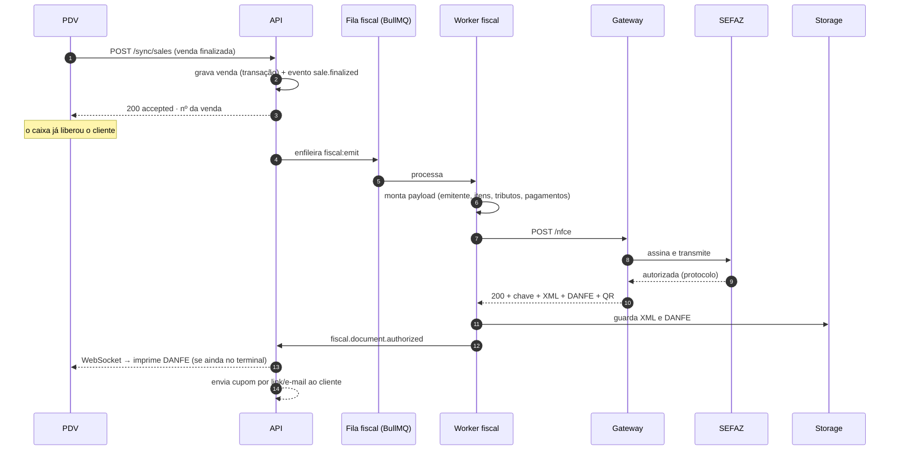
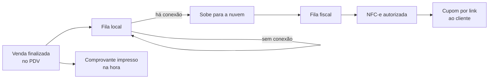
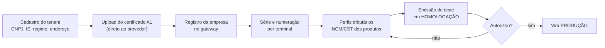

# 06 · Emissão Fiscal via Gateway de Terceiros

> **Decisão do negócio (D3):** a emissão será feita por **API de integração de terceiro**, para que
> ninguém da equipe precise configurar nada junto à Receita Federal ou à SEFAZ. Este documento define
> como isso é implementado, quais são os limites reais dessa escolha e quem é o provedor:
> a **Focus NFe** (§7).

## 1. O que o gateway faz por nós — e o que continua sendo nosso

| Responsabilidade | Gateway | Nós |
|------------------|:-------:|:---:|
| Custódia do certificado digital A1 | ✅ | — |
| Assinatura digital do XML | ✅ | — |
| Comunicação com a SEFAZ de cada UF | ✅ | — |
| Retentativa em indisponibilidade da SEFAZ | ✅ | — |
| Geração do DANFE/PDF e do QR Code | ✅ | — |
| Guarda legal do XML | ✅ (também) | ✅ (cópia própria) |
| **Cálculo correto dos tributos do item** | parcial | ✅ |
| **Cadastro fiscal correto (NCM, CEST, CST/CSOSN, CFOP)** | — | ✅ |
| **Dados do emitente por CNPJ** | — | ✅ |
| **Numeração e série por terminal** | parcial | ✅ |
| **Fila, reprocessamento e correção de rejeição** | — | ✅ |
| **Guarda de 5 anos acessível ao contador do cliente** | — | ✅ |

**Ponto que costuma surpreender:** o gateway tira o trabalho de *infraestrutura* fiscal, não o de
*parametrização* fiscal. Cadastro errado de NCM ou CST continua gerando rejeição — e a rejeição
chega para nós, não para o provedor. Por isso o módulo `fiscal` tem tela de fila de correção e o
cadastro de produto tem validação de NCM na entrada.

## 2. Camada anticorrupção

O provedor fica atrás de uma interface nossa. Trocar de provedor não pode encostar no PDV (RNF-11):

```typescript
// packages/contracts/fiscal.ts
export interface FiscalProvider {
  readonly name: 'focus' | 'plugnotas' | 'tecnospeed' | 'nfeio';
  issue(input: FiscalIssueInput): Promise<FiscalIssueResult>;   // NFC-e / NF-e
  cancel(ref: string, reason: string): Promise<FiscalEventResult>;
  correct(ref: string, text: string): Promise<FiscalEventResult>;
  inutilize(range: NumberRange, reason: string): Promise<FiscalEventResult>;
  status(ref: string): Promise<FiscalStatus>;
  fetchXml(ref: string): Promise<Buffer>;
  fetchDanfe(ref: string): Promise<Buffer>;
  registerCompany(input: CompanyFiscalConfig): Promise<string>; // onboarding do CNPJ
  parseWebhook(raw: unknown, signature: string): FiscalWebhookEvent;
}
```

Cada provedor implementa em `apps/api/src/fiscal/providers/*`. Existe um `FakeFiscalProvider` para
teste automatizado — nenhum teste do PDV depende de rede externa. **Testes de contrato** rodam o
mesmo conjunto de casos contra todos os adaptadores.

## 3. Fluxo de emissão



**A venda nunca espera a nota (A2).** O caixa fecha a venda em < 1s; a nota é autorizada em segundo
plano, tipicamente em 2–5s.

## 4. Tratamento de rejeição

| Classe | Exemplos | Ação automática |
|--------|----------|-----------------|
| **Transitória** | SEFAZ fora do ar, timeout, "serviço paralisado" | Retentativa: 5s → 30s → 2min → 10min → 1h (até 24h) |
| **Corrigível pelo cadastro** | NCM inválido, CST incompatível, CFOP errado | Vai para **fila de correção**; corrigido o cadastro, reenvia com 1 clique |
| **Corrigível pelos dados da venda** | CPF inválido, total divergente | Fila de correção com o campo destacado |
| **Definitiva** | Certificado vencido, CNPJ irregular, IE inapta | Alerta crítico ao cliente **e** à revenda; bloqueia o fechamento contábil do dia (RN-06), nunca a venda |
| **Duplicidade** | Chave já autorizada | Reconcilia: busca o documento existente e vincula à venda |

Toda rejeição vira métrica: `fiscal_rejections_total{code}` — se um código dispara, é erro de
cadastro sistêmico, não azar.

## 5. Sem internet não sai nota — e o caixa não para

### 5.1 A regra, dita com clareza

**A emissão depende de internet.** O sistema é web e o certificado fica custodiado no provedor, então
sem conexão não há como obter autorização da SEFAZ nem assinar o XML localmente. Isso é uma
consequência aceita da decisão D3, não um problema em aberto.

O que **não** depende de internet é a venda. As duas coisas foram deliberadamente separadas:

| Momento | Com internet | Sem internet |
|---------|--------------|--------------|
| Registrar a venda | ✅ | ✅ grava no PDV e entra na fila |
| Receber o pagamento | ✅ | ✅ dinheiro, Pix ou maquineta (que tem link próprio) |
| Entregar comprovante ao cliente | ✅ DANFE da NFC-e | ✅ comprovante de venda, não fiscal |
| **Autorizar a NFC-e** | ✅ em 2–5s | ❌ fica na fila |
| Entregar a nota ao cliente | ✅ impressa ou por link | ✅ por link/e-mail quando a conexão voltar |

### 5.2 Como o sistema se comporta



1. A venda é gravada no PDV com o id que ele mesmo gera, e o cliente leva o comprovante impresso.
2. Quando a conexão volta, a venda sobe (idempotente, sem duplicar) e entra na fila fiscal.
3. A NFC-e é autorizada e o cupom vai ao cliente por link, se ele tiver deixado contato.
4. O painel mostra, o tempo todo, quantas vendas estão sem nota — é a métrica
   `sales_without_document` do §9, a mais importante da lista.

### 5.3 O que reduz a exposição

- **4G de backup em todo quiosque.** É a medida que mais resolve: queda de link de shopping é muito
  mais comum que indisponibilidade da SEFAZ, e o custo é baixo.
- **Alerta imediato** quando houver venda sem nota há mais de uma hora, para a retaguarda agir no dia.
- **Nada de fechamento contábil com pendência**: documento não autorizado bloqueia o fechamento do
  dia (RN-06), sem nunca bloquear a operação da loja.

> **Comunicar ao contador**, não decidir com ele: a nota de uma venda feita durante uma queda de
> conexão é emitida quando a conexão volta. É bom que a contabilidade saiba disso antes do piloto,
> mas a decisão de arquitetura já está tomada.

## 6. Configuração por CNPJ (onboarding do cliente)



Regras que evitam o pior erro do fiscal:

- Ambiente é **por tenant** (`environment: 1|2`). Cliente novo entra em homologação e só vai a
  produção depois de emitir uma nota de teste com sucesso.
- Cada terminal tem **série própria** — duas séries nunca compartilham numeração.
- Numeração é atribuída pelo servidor, sequencial por (CNPJ, série). Nunca pelo PDV.
- Certificado com validade monitorada: alerta em **30, 15 e 5 dias** antes de vencer, ao cliente e
  à revenda. Certificado vencido para a loja inteira, e sempre vence num sábado.

## 7. Provedor escolhido: Focus NFe

**Decisão tomada.** A emissão é feita pela **Focus NFe**. O que segue registra a
avaliação que levou a ela e o que já está implementado.

### 7.0 O que está no código

| Peça | Onde |
|------|------|
| Adaptador HTTP | `apps/api/src/modules/fiscal/providers/focus-nfe.provider.ts` |
| Mapeamento fiscal (puro, sem rede) | `.../providers/focus-mapping.ts` |
| Retorno da Focus (gatilho) | `.../fiscal-webhook.controller.ts` → `POST /v1/webhooks/fiscal/focus?key=…` |
| Configuração | `FISCAL_PROVIDER=focus`, `FOCUS_TOKEN`, `FISCAL_WEBHOOK_SECRET`, `FISCAL_ENVIRONMENT` |

Decisões que o adaptador fixa:

- **Referência = id do nosso documento fiscal.** Reenviar a mesma venda não gera
  nota duplicada: a Focus reconhece a referência e devolve a nota existente
  (`422 nfe_autorizada`), que o adaptador trata consultando, não rejeitando.
- **Autenticação** é HTTP Basic com o token no lugar do usuário e senha vazia.
- **Chave de acesso** vem prefixada com `NFe` (47 caracteres); guardamos os 44
  dígitos, que é o que vai no cupom e na consulta do consumidor.
- **Dois caminhos de conclusão, um garantindo o outro:** o gatilho da Focus e a
  nossa própria fila reconsultando. Webhook perdido não deixa nota presa.
- **Indisponibilidade (5xx, timeout, queda de rede) não vira rejeição** — volta
  para a fila. Erro de cadastro (NCM, CFOP, CSOSN) vai direto para a tela de
  correção, porque reenviar não resolve.
- O segredo do gatilho viaja na URL porque a Focus não assina a chamada; é o
  mecanismo que ela recomenda. Sem `FISCAL_WEBHOOK_SECRET` a rota recusa tudo.

### 7.1 Critérios de avaliação

| Peso | Critério |
|:----:|----------|
| ⭐⭐⭐ | Gestão de **múltiplos CNPJs por conta** (essencial para revenda) |
| ⭐⭐⭐ | Cobertura de **NFC-e em todas as UFs** onde há ou haverá quiosque |
| ⭐⭐⭐ | Webhook confiável de retorno (não depender de *polling*) |
| ⭐⭐ | Custo por documento em escala e modelo de repasse para revenda |
| ⭐⭐ | Ambiente de homologação de verdade, com sandbox estável |
| ⭐⭐ | Qualidade de documentação e SDK; suporte técnico com SLA |
| ⭐⭐ | Distribuição DF-e (busca automática de XML de compra — habilita RF-06) |
| ⭐ | NFS-e municipal (necessário só na F5, com a Ordem de Serviço) |

### 7.2 Posicionamento dos candidatos avaliados

| Provedor | Perfil | Observação |
|----------|--------|-----------|
| **PlugNotas** | Focado em **software houses**, gestão multi-CNPJ, API REST | Melhor encaixe com modelo de revenda |
| **Tecnospeed** | Tradicional no mercado de software house, com API madura | Alternativa sólida, especialmente para volume alto |
| **Focus NFe** ✅ | API REST simples e documentação direta | **Escolhido** — menor curva de implementação |
| **NFe.io / eNotas** | Boa cobertura de NFS-e municipal | Ganha peso quando a Ordem de Serviço entrar (F5) |

> **Aviso honesto:** preços, limites e detalhes de produto desses fornecedores mudam com frequência
> e **precisam ser confirmados diretamente com o comercial de cada um** — não tome os
> posicionamentos acima como cotação. O que este documento fixa são os **critérios** e o **teste**.

### 7.3 Por que a Focus

Pesou a curva de implementação: API REST direta, documentação sem ambiguidade e
homologação que funciona de verdade — o que permitiu fechar o MVP no prazo. O
encaixe com revenda multi-CNPJ é atendido por um cadastro de empresa (e um token)
por CNPJ, que é exatamente o recorte do nosso tenant.

Isso **não é uma porta fechada**. A decisão continua atrás do adaptador (§2):
trocar de fornecedor é escrever um `FiscalProvider` novo, sem tocar no PDV nem no
resto da API. `PlugNotas` e `Tecnospeed` permanecem como alternativas avaliadas
caso o volume ou o custo por documento mudem a conta.

### 7.4 Checklist de homologação antes de ir para produção

Com o CNPJ cadastrado e o certificado A1 no painel, em `FISCAL_ENVIRONMENT=2`:

1. Cadastrar 2 CNPJs na mesma conta e emitir NFC-e por ambos.
2. Emitir 200 NFC-e em rajada e medir latência p50/p95 e taxa de erro.
3. Cancelar uma nota, fazer uma carta de correção e inutilizar uma faixa.
4. Forçar uma rejeição de NCM e conferir se a mensagem de erro é acionável.
5. Testar o webhook: derrubar nosso endpoint por 5 min e verificar o reenvio.
6. Derrubar a conexão no meio de um envio e verificar se o documento não fica em estado ambíguo.
7. Baixar XML e DANFE de uma nota emitida há mais de 30 dias.
8. Medir o tempo real de onboarding de um CNPJ novo, do zero até a primeira nota.

Critério de liberação: p95 < 5s, gatilho confiável, onboarding de CNPJ < 1h,
mensagem de erro acionável pelo operador. Nota de homologação não tem valor
fiscal — é por isso que ela é o teste seguro antes de virar a chave.

## 8. Guarda e entrega ao contador

- XML e DANFE em object storage, caminho `tenant/{cnpj}/{ano}/{mês}/{chave}.xml`, retenção de 5 anos.
- Bucket com *object lock* (WORM) — documento fiscal não pode ser apagado nem por engano.
- Tela **"Exportar competência"**: baixa um ZIP com todos os XMLs do mês + planilha de conferência.
- Papel `contador` com acesso somente a essa área — nada de venda, custo ou dado pessoal do cliente final.

## 9. Métricas fiscais monitoradas

| Métrica | Alerta |
|---------|--------|
| `fiscal_queue_depth` | > 50 documentos ou > 15min de espera |
| `fiscal_emit_duration_p95` | > 8s |
| `fiscal_rejection_rate` | > 2% em 1h |
| `fiscal_certificate_days_left` | ≤ 30 dias |
| `fiscal_provider_errors` | qualquer 5xx do provedor em sequência |
| `sales_without_document` | > 0 por mais de 1h — a métrica mais importante da lista |
