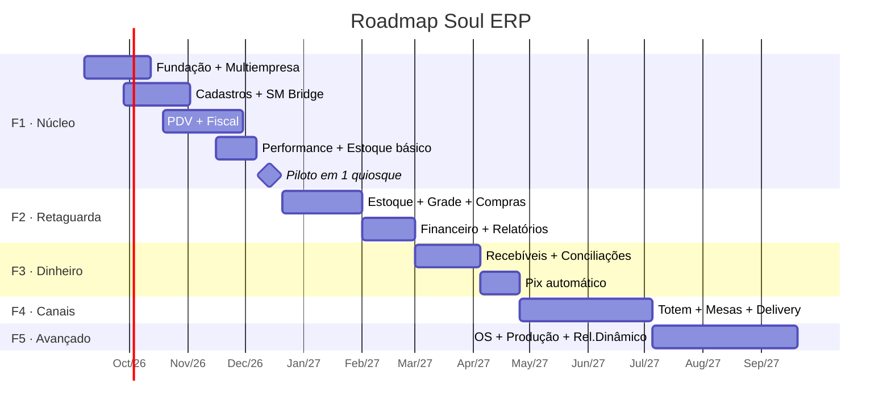

# 08 · Roadmap, Esforço e Riscos

> Estimativas em **semanas de time**, para o time-base descrito no §3. São estimativas de
> arquitetura — o time deve reestimar com base na própria velocidade. Onde houver discordância
> grande, é sinal de que algum requisito está mal entendido: vale conversar antes de codificar.

## 1. Fases

### F1 · Núcleo — "o quiosque vende e emite nota" · ~14 semanas

| Épico | Entrega | Sem. |
|-------|---------|-----:|
| E1.1 Fundação | Monorepo, CI/CD, Docker, Postgres, autenticação, RLS, esqueleto dos módulos | 3 |
| E1.2 Multiempresa | Tenant/CNPJ, grupo econômico, planos, entitlements, medição de uso | 2 |
| E1.3 Cadastros | Produto, SKU, grade sabor × tamanho, código de barras, preço por loja, perfis tributários | 2 |
| E1.4 SM Bridge | Agente Windows: impressora ESC/POS, gaveta, instalador e autoatualização | 2 |
| E1.5 PDV | Venda, pagamentos, caixa, sangria, offline + outbox, impressão | 4 |
| E1.6 Fiscal | Adaptador do gateway, fila, webhook, guarda de XML, fila de correção | 3 |
| E1.7 Performance | Dashboard ao vivo, curva de horário, mix, saúde do terminal, alertas | 2 |
| E1.8 Estoque básico | Saldo, baixa na venda, entrada manual, ajuste, alerta de mínimo | 1,5 |
| E1.9 Piloto | Homologação fiscal, treinamento, rollout em 1 quiosque, ajustes | 2 |

*(épicos rodam em paralelo entre as trilhas backend/frontend/bridge — daí o total < soma)*

**Critério de conclusão da F1:** um quiosque real opera um dia inteiro, incluindo 2h sem internet,
sem perder venda — e, ao fim do dia, todas as notas do período estão autorizadas.

### F2 · Retaguarda — "controlo estoque e dinheiro" · ~10 semanas
Estoque completo (lote/validade/FEFO, inventário por celular, transferência, curva ABC) ·
Grade com tela de matriz · Compras e importação de XML com de-para · Financeiro (contas a
pagar/receber, fluxo de caixa, DRE) · Relatórios fixos com exportação e agendamento.

### F3 · Dinheiro fino — "sei quanto realmente entrou" · ~9 semanas
Contratos de cartão e previsão de recebíveis · Conciliação de cartões (EDI/API) · Conciliação
bancária (OFX/CNAB, motor de regras) · Pix com baixa automática por webhook do PSP.

### F4 · Canais — "vendo por mais portas" · ~10 semanas
Totem de autoatendimento · Mesas/comandas com KDS · Delivery com integração iFood · App de consulta
para o gerente.

### F5 · Avançado — "o cliente se vira sozinho" · ~11 semanas
Ordem de serviço com NFS-e · Produção com ficha técnica · **Relatório dinâmico** com modelo
semântico · API pública para clientes.

## 2. Marcos de decisão

| Marco | Quando | Decisão que precisa estar tomada |
|-------|--------|----------------------------------|
| M0 | Antes da F1 | **Contabilidade informada** de que a nota de uma venda feita durante queda de conexão sai quando o link volta ([06 §5](./06-FISCAL.md)) |
| M1 | Semana 2 | Provedor fiscal escolhido após a POC de 1 semana |
| M2 | Semana 4 | Impressora e gaveta reais testadas com o SM Bridge |
| M3 | Fim da F1 | Piloto aprovado → libera rollout para os demais quiosques |
| M4 | Fim da F2 | Produto tem escopo mínimo para ser **vendido a terceiros** |
| M5 | Fim da F3 | Decisão sobre digitar o NSU no caixa, com base na taxa real de acerto da conciliação |

## 3. Time sugerido

| Papel | Qtd | Foco |
|-------|:---:|------|
| Tech lead / arquiteto | 1 | Fronteiras de módulo, revisão, decisões técnicas |
| Backend (Node/Nest/Postgres) | 2 | API, workers, fiscal, financeiro |
| Frontend (React) | 2 | PDV (1 dedicado) e retaguarda/dashboard |
| Dev desktop/integração | 1 | SM Bridge e periféricos (pode ser meio período após a F1) |
| QA | 1 | Testes automatizados, teste de campo no quiosque |
| Product/analista fiscal | 0,5 | Requisito, parametrização fiscal, ponte com o contador |

Sem o **analista fiscal** (mesmo meio período), o time de dev vira analista fiscal amador e a F1
atrasa. É a economia que mais custa caro neste tipo de projeto.

## 4. Ordem de ataque recomendada

1. **Fundação + multiempresa primeiro.** Retrofitar `tenant_id` e RLS depois é reescrever tudo.
2. **SM Bridge cedo**, em paralelo ao PDV — periférico sempre surpreende, e o feedback precisa chegar
   antes de o PDV estar pronto.
3. **Fiscal com `FakeFiscalProvider`** desde o início; o adaptador real entra quando o contrato fechar.
4. **Offline desde o primeiro dia do PDV.** Adicionar offline num PDV online-first é reescrever o PDV.
5. **Telemetria junto com o PDV**, não depois — é ela que torna o piloto diagnosticável.

## 5. Riscos

| # | Risco | Prob. | Impacto | Mitigação |
|---|-------|:-----:|:-------:|-----------|
| R-01 | Queda de internet acumula vendas sem nota | Média | Médio | 4G de backup em todo quiosque; alerta de venda sem documento em < 1h; fila fiscal reprocessa sozinha |
| R-02 | Impressora do quiosque com comando ESC/POS fora do padrão | Média | Médio | Testar equipamento real no M2; driver por modelo; falha de impressão não bloqueia a venda |
| R-03 | Rejeição fiscal em massa por cadastro errado (NCM/CST) | **Alta** | Alto | Validação de NCM no cadastro, emissão de teste em homologação por cliente, fila de correção |
| R-04 | Conciliação imprecisa porque o pagamento é digitado | **Alta** | Médio | Capturar bandeira e parcelas na venda; medir a taxa de acerto; avaliar digitar o NSU do comprovante |
| R-05 | Internet do shopping instável demais | Alta | Médio | Offline-first + 4G; alertas de terminal offline |
| R-06 | Vazamento entre tenants | Baixa | **Crítico** | RLS + teste de invasão obrigatório no CI |
| R-07 | Escopo inflando (a lista tem 18 módulos) | **Alta** | Alto | Fases fechadas; nada entra na F1 sem tirar outra coisa |
| R-08 | Provedor fiscal com indisponibilidade prolongada | Baixa | Alto | Adaptador permite segundo provedor; fila segura o volume |
| R-09 | Time subestima o PDV ("é só uma tela de venda") | Média | Alto | PDV tem dev dedicado; offline, periférico e fiscal são três projetos dentro de um |
| R-10 | Custo de gateway fiscal comprime a margem do plano | Média | Médio | Negociar por volume; repassar excedente conforme `plan.overage` |

## 6. O que NÃO fazer

- ❌ Microsserviços na v1 — complexidade sem benefício com este time e este volume.
- ❌ PDV online-first "porque offline é difícil" — é o requisito que define o produto.
- ❌ Integrar TEF "já que estamos aqui" — a operação usa a maquineta da adquirente, e o ganho não
  paga a homologação.
- ❌ Emitir nota direto na SEFAZ "para economizar o gateway" — decisão já tomada (D3) e o custo real
  é meses de trabalho e manutenção fiscal permanente.
- ❌ Deixar entitlements para depois — feature sem chave de plano é retrabalho garantido na revenda.
- ❌ Multi-tenant "depois a gente separa por banco" — a decisão de isolamento é estrutural, não incremental.
- ❌ Construir relatório dinâmico antes dos relatórios fixos — ninguém monta relatório do zero se o
  básico não existe.
