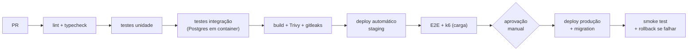

# 10 · Qualidade, Operação e DevOps

## 1. Estratégia de testes

```
        ╱╲          E2E (5%) — Playwright
       ╱  ╲         venda completa, offline→sync, emissão fiscal em homologação
      ╱────╲
     ╱      ╲       Integração (25%) — Postgres real em container
    ╱        ╲      repositórios, RLS, transações, adaptadores, webhooks
   ╱──────────╲
  ╱            ╲    Unidade (70%) — Vitest
 ╱______________╲   regras de negócio, cálculo, impostos, FEFO, conciliação
```

### Testes que este projeto não pode deixar de ter

| Teste | Por que é obrigatório |
|-------|----------------------|
| **Isolamento entre tenants** (6 caminhos) | Vazamento acaba com um produto de revenda |
| **Idempotência da sincronização** | Reenviar 100× tem de criar 1 venda |
| **Offline → online completo** | Vender offline por 72h, religar e conferir tudo |
| **Aritmética de dinheiro** | Rateio de desconto, imposto e troco em centavos |
| **FEFO com lote vencido** | Sorvete vencido não pode passar no caixa |
| **Grade de produto** | Sabor × tamanho errado no cadastro vira preço errado na venda |
| **Rejeição fiscal e reprocessamento** | Fila fiscal parada é receita sem nota |
| **Fechamento de caixa com diferença** | Regra de conferência cega e justificativa |
| **Entitlement bloqueando no servidor** | Cliente do plano Básico não pode acessar módulo do Completo |
| **Relógio do PDV adiantado/atrasado** | Não pode furar relatório nem duplicar venda |

### Metas

- Cobertura global ≥ 70%; módulos `sales`, `fiscal`, `payments`, `tenancy` e `money` ≥ 90%.
- Nenhum PR entra com teste `skip` nos casos obrigatórios acima.
- Teste de campo: antes de cada release do PDV, um dia de operação real em um quiosque piloto.

## 2. Qualidade de código

| Ferramenta | Uso |
|-----------|-----|
| TypeScript `strict` | Sem `any` implícito; `noUncheckedIndexedAccess` |
| ESLint + Prettier | Padrão único, formatação automática |
| `dependency-cruiser` | **Reprova PR que quebre fronteira de módulo** |
| Zod | Validação de entrada em toda borda (API, webhook, sync) |
| Conventional Commits | Changelog e versionamento automáticos |
| PR pequeno (< 400 linhas) | Revisão de verdade em vez de aprovação por cansaço |

Revisão obrigatória de segunda pessoa em: migração de banco, `fiscal`, `payments`, `iam`, `tenancy`.

## 3. CI/CD



**Migração de banco:** sempre compatível para trás (expand → migrate → contract), aplicada antes do
deploy do código. Nada de migração que quebre a versão anterior — o PDV de um quiosque pode estar
uma versão atrás por dias.

**Release do PDV:** canário — 1 terminal, depois 1 loja, depois todos. Reversão automática se a taxa
de erro subir. Terminal com venda aberta **nunca** atualiza no meio do atendimento.

## 4. Observabilidade

| Sinal | Ferramenta | O que responde |
|-------|-----------|----------------|
| Logs | OpenTelemetry → Loki | "O que aconteceu com a venda X?" (`traceId`, `tenantId`, `terminalId`) |
| Traces | Tempo | "Onde foram os 8s da emissão?" (do PDV até o gateway) |
| Métricas | Prometheus + Grafana | "A fila fiscal está crescendo?" |
| Erros | Sentry (API e front) | "Qual erro novo apareceu nesta release?" |
| Telemetria de PDV | Tabelas próprias + dashboard | "O quiosque Q03 está saudável?" ([04 §3](./04-MODULOS.md)) |

### Alertas que acordam alguém

| Alerta | Limiar |
|--------|--------|
| `sales_without_document` | > 0 por mais de 1h |
| `fiscal_queue_depth` | > 50 ou parada há 15min |
| `sync_failures` | > 5% em 10min |
| API 5xx | > 1% em 5min |
| Latência p95 | > 1s por 10min |
| Terminal offline em horário comercial | > 15min |
| Réplica de leitura atrasada | > 60s |
| Espaço em disco do Postgres | < 20% |
| **Partição do mês seguinte não criada** | 7 dias antes da virada |
| Certificado fiscal | ≤ 30 dias para vencer |

Regra: alerta que dispara sem exigir ação é removido ou ajustado. Alerta ignorado é pior que
alerta inexistente.

## 5. Backup e recuperação

| Item | Política |
|------|----------|
| PostgreSQL | Backup completo diário + WAL contínuo (PITR) · **RPO ≤ 5min, RTO ≤ 4h** |
| Retenção | 30 dias de PITR; mensais guardados por 5 anos (exigência fiscal) |
| Object storage | Versionamento + *object lock* nos XMLs; réplica em segunda região |
| Redis | Sem backup — é cache e fila reconstruível (jobs críticos persistem no Postgres antes) |
| **Teste de restauração** | **Mensal, em ambiente separado, com relatório** |
| PDV | O outbox local é o backup natural da venda até o `ack` do servidor |

Backup que nunca foi restaurado não é backup. O ensaio mensal é item de checklist, com responsável.

## 6. Operação do dia a dia

**Runbooks obrigatórios** (no repositório de operações):
fila fiscal parada · terminal offline · venda não sincronizada · rejeição fiscal em massa ·
certificado vencido · banco lento · rollback de release · restauração de backup ·
suspensão e reativação de tenant.

**Suporte da revenda** conta com: busca de venda por número/valor/data, linha do tempo da venda
(PDV → sync → fiscal), estado do terminal, reenvio manual de documento fiscal, comando remoto de
sincronizar/atualizar e impersonation auditada.

## 7. Ambiente de desenvolvimento

```bash
git clone <repo> && cd soul-erp
pnpm install
docker compose up -d          # postgres, redis, minio, mailhog
pnpm db:migrate && pnpm db:seed   # tenant demo com 2 quiosques e catálogo de sorvete
pnpm dev                      # api :3000 · pdv :5173 · web :5174 · backoffice :5175
```

O seed cria dados realistas (grade de sabores e tamanhos, vendas de duas semanas) para que o
dashboard tenha o que mostrar desde o primeiro dia. `FAKE_FISCAL=true` emite notas falsas sem
depender de provedor externo.

## 8. Definição de pronto

Uma entrega só está pronta quando:

- [ ] Testes automatizados passando, incluindo os obrigatórios do §1
- [ ] Isolamento de tenant verificado na feature nova
- [ ] Entitlement declarado (se for feature de plano)
- [ ] Auditoria gravando, se a ação for sensível
- [ ] Comportamento offline definido (funciona? enfileira? bloqueia com mensagem clara?)
- [ ] Métrica e alerta configurados, se for caminho crítico
- [ ] Documentação e OpenAPI atualizados
- [ ] Testado com **teclado apenas**, se for tela de PDV
- [ ] Revisado por segunda pessoa
